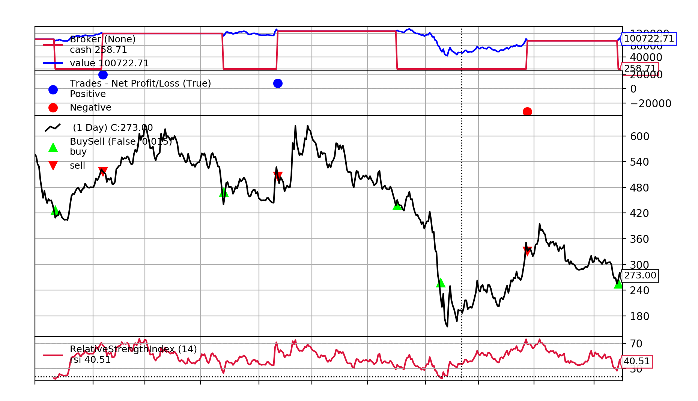
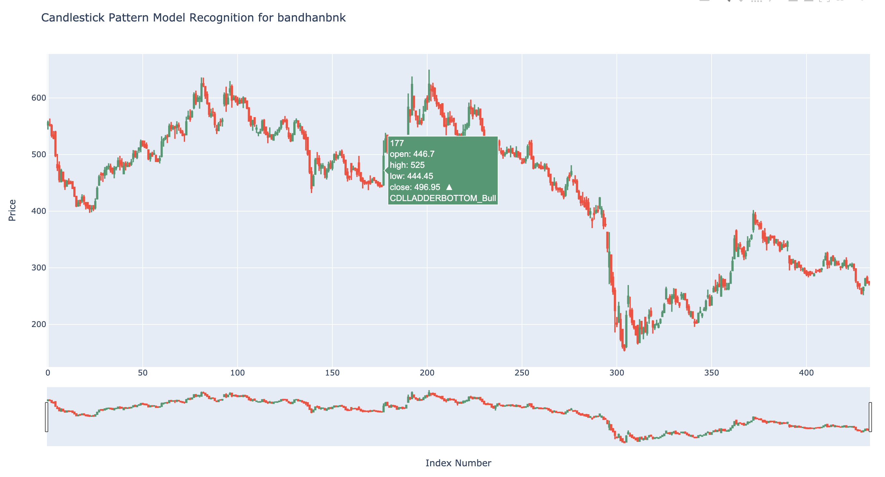
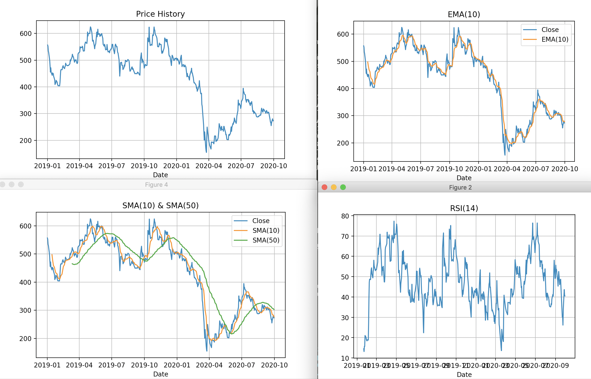
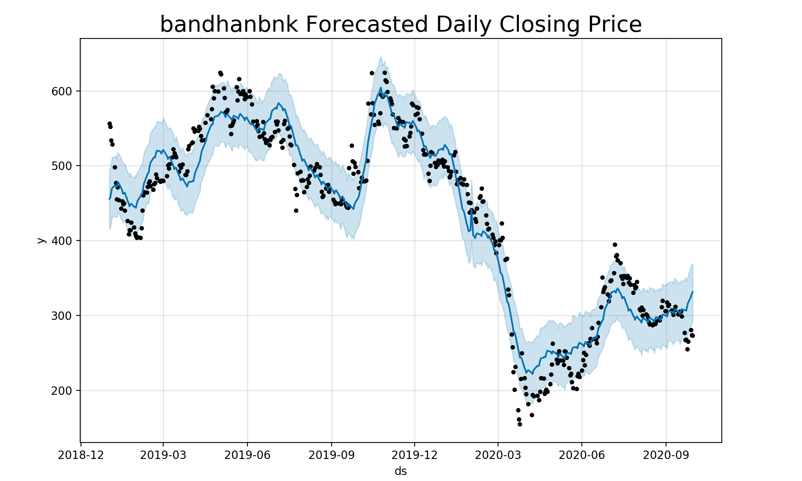
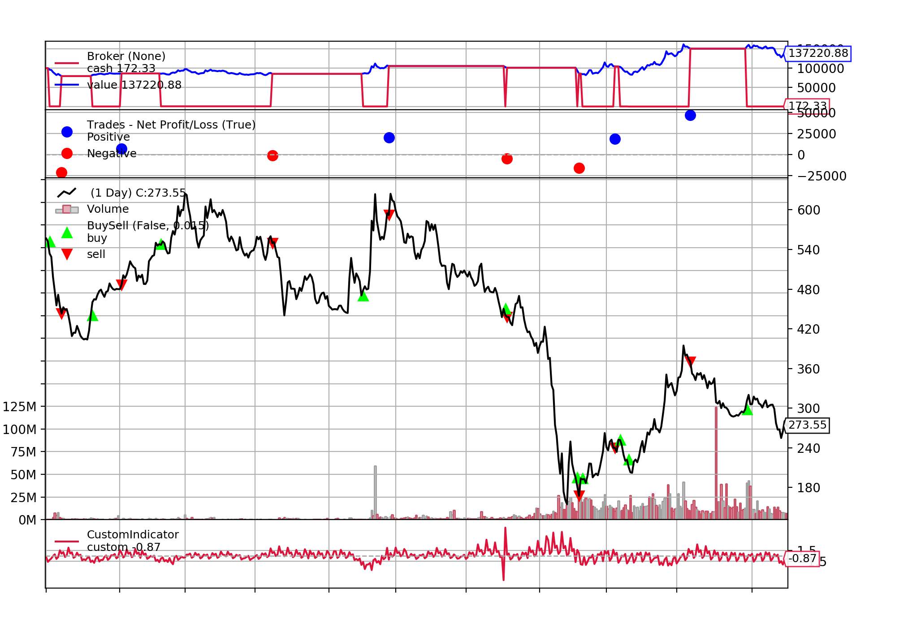
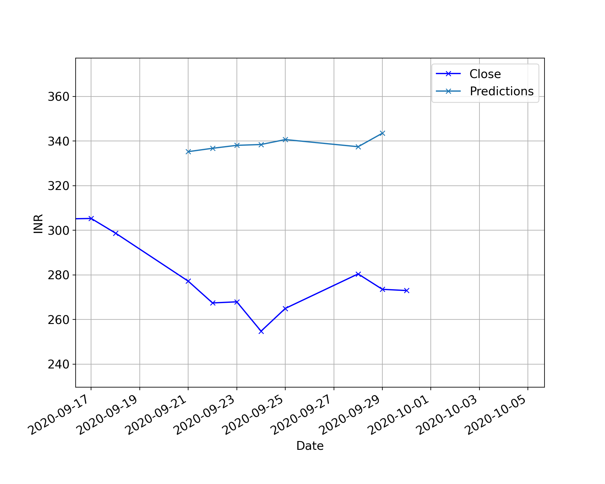

# nseta :nerd_face:

[](https://travis-ci.com/pkjmesra/nseta)
[](https://github.com/pkjmesra/nseta/actions?query=workflow%3ACI%2FCD)
[](https://github.com/pkjmesra/nseta/actions?query=workflow%3AUbuntu)
[](https://github.com/pkjmesra/nseta/actions?query=workflow%3AmacOS)
[](https://github.com/pkjmesra/nseta/actions?query=workflow%3AWindows)
[](https://github.com/pkjmesra/nseta/blob/main/LICENSE)
[](https://pepy.tech/project/nseta)
[](https://badge.fury.io/py/nseta)
[](https://badge.fury.io/py/nseta)
[](https://app.codacy.com/gh/pkjmesra/nseta?utm_source=github.com&utm_medium=referral&utm_content=pkjmesra/nseta&utm_campaign=Badge_Grade)
[](https://www.codacy.com/gh/pkjmesra/nseta/dashboard?utm_source=github.com&utm_medium=referral&utm_content=pkjmesra/nseta&utm_campaign=Badge_Coverage)
[](https://lgtm.com/projects/g/pkjmesra/nseta/alerts/)
[](https://lgtm.com/projects/g/pkjmesra/nseta/context:python)
[](https://codecov.io/gh/pkjmesra/nseta)
[](https://codeclimate.com/github/pkjmesra/nseta/test_coverage)
[](https://requires.io/github/pkjmesra/nseta/requirements/?branch=main)
[](http://prospector.landscape.io/en/master/)
[](https://codeclimate.com/github/pkjmesra/nseta/maintainability)
[](https://www.paypal.com/paypalme/pkjmesra/5)


Python Library (and console/CLI application) to 
-  Get publicly available data from [NSE India website](https://www1.nseindia.com/)  ie. stock live-quotes and historical data[ *EQUITY ONLY* AT THIS TIME. No support for Futures/Options/Derivatives yet.]
- Plot various technical indicators
- Pattern recognition and fitment using candlestick charts
- Backtest trading strategies
- Scan for test trading strategies for all stocks in one go that will tell you how much you'd have made following a strategy
- Forecasting with standard as well as custom strategies
- Get price action, PE-historical data and live-quotes for stocks
- Create scanners and generate signals for various technical indicators or for BUY/SELL
  - Scan for live, swing, intraday and volume trading strategies
  - Scan for all stocks for which RSI shows oversold/overbought condition or define your own cut-offs in config.txt
  - Scan for all stocks that show high volume growth from yesterday or 7-day average volume
  - Get notified on-console when a stock has crossed a critical support/resistance level
  - Scan based on bbands or any other technical indicator based filter criteria
  - Keep the scans running in the background for the entire duration of market hours
  - Get custom top-picks recommendations for stocks for intraday trades based on 1-min and 5-min MACD alignment
- Create and build your own trading strategy
- Scan for latest news/headlines related to stocks

## Disclaimer
- The recommendations that you receive when you run the scan for intraday or swing trading is only for academic research purposes.
- Though, you are free to take the recommended BUY/SELL positions, any loss you make from those are entirely at your own risk.
- The author of this library/console cannot be held responsible and is deemed free from any legal liability.

## Donate

It takes a lot of time/effort to develop, implement, test and maintain the codebase. When possible, please donate and buy me a coffee :-)
[](https://otechie.com/pkjmes)
[](https://www.paypal.com/paypalme/pkjmesra/5)

## Tech Disclaimer
This has been built and tested only on macOS Big Sur (v11+). You may wish to check the `.travis.yml` or the `python-publish.yml` file to understand how to build from source. If you test it on a platform other than macOS and find issues, please do report those in the `issues` tab above.

## Libraries Required
- You need to install TA-LIB, fastquant and fbprophet aside from other libraries noted in requirements.txt. TA-LIB will need to be installed not just as a python package but separately as a library as well. See https://github.com/mrjbq7/ta-lib

- (See requirements.txt file for more)

For Windows systems you can install Anaconda, this will cover many dependancies (You'll have to install requests and beautifulsoup additionally though)

<details>
<summary>

## Installation

</summary>

- From code
  ```
  python3 setup.py clean build install
  ```
- Python pip
  ```
  pip3 install nseta
  ```
- Installing specific version
  ```
  pip3 install nseta==0.6.202
  ```
  You can also directly install specific versions from pypi.org:
  ```
  pip install --index-url https://pypi.org/simple/ --extra-index-url https://pypi.org/simple nseta==<Specific_Version>
  ```

- Python shell
  ``` 
  python3 -m pip install --upgrade nseta
  ```
- Wheel (.whl) file from PyPi.org

  Just go ahead and download the ```.whl``` file from ```https://pypi.org/project/nseta/#files``` and install from the downloaded directory:

  ```
  pip3 install ./nseta-0.6.202-py3-none-any.whl
  ```
  where `0.6.202` is the version of the library.

- Specific test versions(under development) can be installed from test.pypi.org

  ```
  pip install --index-url https://test.pypi.org/simple/ --extra-index-url https://pypi.org/simple nseta==<Specific_Version>
  ```

After installation you can check what version you got installed
  ```
  python3 -c "import nseta; print(nseta.__version__)"
  ```

- Docker

  ```
  docker run -it pkjmesra/nseta:latest sh
  ```
  
  When in doubt or when you encounter an error on Windows/macOS or Ubuntu/Linux, please see the github workflows under Github actions. If you follow those steps, you won't have any trouble installing all dependencies without fail.

</details>

## Usage

- Top level command options that provide you with various features

  ```python

  #Usage Commands (You can use nsetacli or nseta - either is good.)
  $ $ nseta
  Usage: nseta [OPTIONS] COMMAND [ARGS]...

  Options:
    --debug / --no-debug  --debug to turn debugging on. Default is off
    --version             Shows the version of this library
    --trace / --no-trace  --trace to turn tracing on (works only with --debug).
                          Default is off.
    -f, --filter TEXT     --filter <TEXT> to show only logs that match the
                          filter text. Works only with --debug
    --help                Show this message and exit.

  Commands:
    clear                  Force clears log files, downloaded contents etc.
    create-cdl-model       Create candlestick model.Plot uncovered patterns
    forecast-strategy      Forecast & measure performance of a trading model
    history                Get price history of a security for given dates
    live-quote             Get live price quote of a security
    news                   Scans for news for the given tickers or all
                           tickers from stocks.txt
    pe-history             Get PE history of a security for given dates
    plot-ta                Plot various technical analysis indicators
    scan                   Scan live and intraday for prices and signals.
    scan-trading-strategy  Test/Measure the performance of your trading...
    test-trading-strategy  Measure the performance of your trading strategy
    top-picks              Scans for price action and signals for intraday or swing trading recommendations.
  ```
- Sample commands

  ```python

    Example:
    nseta clear -d
    nseta create-cdl-model -S bandhanbnk -s 2019-07-30 -e 2020-11-20
    nseta forecast-strategy -S bandhanbnk -s 2019-07-30 -e 2020-11-20 --strategy rsi -c
    nseta history -S bandhanbnk -s 2019-07-30 -e 2020-11-20
    nseta live-quote -S bandhanbnk -gowvb
    nseta news
    nseta news -S HDFCBANK,BANDHANBNK
    nseta pe-history -S bandhanbnk -s 2019-07-30 -e 2020-11-20
    nseta plot-ta -S bandhanbnk -s 2019-07-30 -e 2020-11-20
    nseta scan -S HDFC,ABB -s -c -a 
    nseta scan -i -c
    nseta scan -l -c
    nseta scan -s -c -a
    nseta scan -v -c -a
    nseta scan-trading-strategy -S bandhanbnk -s 2019-07-30 -e 2020-11-20 --strategy rsi -c
    nseta scan-trading-strategy -s 2019-07-30 -e 2020-11-20 --strategy rsi -c
    nseta scan-trading-strategy -s 2019-07-30 -e 2020-11-20 -c
    nseta scan-trading-strategy -i -c
    nseta test-trading-strategy -S bandhanbnk -s 2019-07-30 -e 2020-11-20 --strategy rsi -c
    nseta top-picks -i -c
    nseta top-picks -s -c
    nseta top-picks -S HDFCBANK,BANDHANBNK -i -c 
  ```

- Test your trading strategies

  ```python
  nseta test-trading-strategy
  Please provide start and end date in format yyyy-mm-dd
  Usage:  [OPTIONS]

    Measure the performance of your trading strategy

  Options:
    -S, --symbol TEXT               Security code
    -s, --start TEXT                Start date in yyyy-mm-dd format
    -e, --end TEXT                  End date in yyyy-mm-dd format
    --strategy [rsi|smac|macd|emac|bbands|multi|custom]
                                    rsi, smac, macd, emac, bbands, multi,
                                    custom. Choose one.
    -u, --upper TEXT                Used as upper limit, for example, for RSI.
                                    Only when strategy is "custom", we buy the
                                    security when the predicted next day return
                                    is > +{upper} %
    -l, --lower TEXT                Used as lower limit, for example, for RSI.
                                    Only when strategy is "custom", we sell the
                                    security when the predicted next day return
                                    is < -{lower} %
    --autosearch / --no-autosearch  --auto for allowing to automatically measure
                                    the performance of your trading strategy on
                                    multiple combinations of parameters.
    -i, --intraday                  Test trading strategy for the current
                                    intraday price history (Optional)
    --help                          Show this message and exit.
  ```

- Test your trading strategies (for example, using *RSI* as technical indicator)

  ```python
  $ nseta test-trading-strategy -S bandhanbnk -s 2020-01-01 -e 2020-10-03 --strategy rsi

  Time used (seconds): 0.13728976249694824
  Optimal parameters: {'init_cash': 100000, 'buy_prop': 1, 'sell_prop': 1, 'commission': 0.0075, 'execution_type': 'close', 'channel': None, 'symbol': None, 'rsi_period': 14, 'rsi_upper': 70, 'rsi_lower': 15}
  Optimal metrics: {'rtot': 0.4850052910757702, 'ravg': 0.00255265942671458, 'rnorm': 0.9026928562651005, 'rnorm100': 90.26928562651005, 'sharperatio': None, 'pnl': 62418.36, 'final_value': 162418.36025}
     rsi_period  rsi_upper  rsi_lower  init_cash    final_value       pnl
  0          14         70         15     100000  162418.360250  62418.36
  1          11         70         15     100000  154007.773625  54007.77
  2           7         70         15     100000   96213.602375  -3786.40
  3          14         70         30     100000   83074.073000 -16925.93
  4          11         70         30     100000   78397.304875 -21602.70
  ```
  

- Check historical data and export to csv file

  ```python
  $ nseta history -S bandhanbnk -s 2019-01-01 -e 2020-09-30
         Symbol Series        Date  Prev Close    Open   High     Low    Last   Close    VWAP   Volume      Turnover  Trades  Deliverable Volume  %Deliverable
  0  BANDHANBNK     EQ  2019-01-01      550.15  552.50  560.0  544.10  558.00  556.70  552.21   589317  3.254256e+13   16658              175430        0.2977
  1  BANDHANBNK     EQ  2019-01-02      556.70  553.00  563.7  549.60  551.40  552.15  556.91   834846  4.649319e+13   32119              250782        0.3004
  2  BANDHANBNK     EQ  2019-01-03      552.15  551.00  554.0  530.00  532.05  533.80  540.61   620161  3.352631e+13   18616              282037        0.4548
  3  BANDHANBNK     EQ  2019-01-04      533.80  534.25  541.7  527.05  528.05  528.90  533.42   579027  3.088645e+13   22405              186702        0.3224
  4  BANDHANBNK     EQ  2019-01-07      528.90  540.00  542.0  495.55  495.55  498.05  509.49  2684675  1.367813e+14   76816             1160901        0.4324
  Saved to: bandhanbnk.csv
  ```
- Create candlestick model

  ```python
  nseta create-cdl-model
  Usage:  [OPTIONS]

    Create candlestick model.Plot uncovered patterns

  Options:
    -S, --symbol TEXT       Security code
    -s, --start TEXT        Start date in yyyy-mm-dd format
    -e, --end TEXT          End date in yyyy-mm-dd format
    -o, --file TEXT         Output file name. Default is {symbol}.csv
    --steps / --no-steps    --steps for saving intermediate steps in output file
    -f, --format [csv|pkl]  Output format, pkl - to save as Pickel and csv - to
                            save as csv
    --help                  Show this message and exit.
  ```

- Create candlestick models with pattern recognition

  ```python
  $ nseta create-cdl-model -S bandhanbnk -s 2019-01-01 -e 2020-09-30 --steps
                  Symbol Series  Prev Close    Open   High  ...  CDLUNIQUE3RIVER  CDLUPSIDEGAP2CROWS  CDLXSIDEGAP3METHODS  candlestick_pattern  candlestick_match_count
  Date                                                      ...                                                                                                        
  2019-01-01  BANDHANBNK     EQ      550.15  552.50  560.0  ...                0                   0                    0           CDLHARAMI_Bull                      0.0
  2019-01-02  BANDHANBNK     EQ      556.70  553.00  563.7  ...                0                   0                    0           CDLHARAMI_Bull                      0.0
  2019-01-03  BANDHANBNK     EQ      552.15  551.00  554.0  ...                0                   0                    0           CDLMATCHINGLOW_Bull                      0.0
  2019-01-04  BANDHANBNK     EQ      533.80  534.25  541.7  ...                0                   0                    0           CDLBELTHOLD_Bull                      0.0
  2019-01-07  BANDHANBNK     EQ      528.90  540.00  542.0  ...                0                   0                    0           CDLTHRUSTING_Bear                      0.0

  [5 rows x 72 columns]
  Model saved to: bandhanbnk.csv
  Candlestick pattern model plot saved to: bandhanbnk_candles.html
  ```
  

- Create various plots for analysis with technical indicators 
  ```python
  $ nseta plot-ta -S bandhanbnk -s 2019-01-01 -e 2020-09-30
  ```
  

- Forecast strategies

  ```python
  nseta forecast-strategy
  Usage:  [OPTIONS]

    Forecast & measure performance of a trading model

  Options:
    -S, --symbol TEXT               Security code
    -s, --start TEXT                Start date in yyyy-mm-dd format
    -e, --end TEXT                  End date in yyyy-mm-dd format
    --strategy [rsi|smac|macd|emac|bbands|multi|custom]
                                    rsi, smac, macd, emac, bbands, multi,
                                    custom. Choose one.
    -u, --upper FLOAT               Only when strategy is "custom". We buy the
                                    security when the predicted next day return
                                    is > +{upper} %
    -l, --lower FLOAT               Only when strategy is "custom". We sell the
                                    security when the predicted next day return
                                    is < -{lower} %
    --help                          Show this message and exit.
  ```
- Create forecast strategies and verify them

  ```python
  $ nseta forecast-strategy -S bandhanbnk -s 2019-01-01 -e 2020-09-30 --upper 1.5 --lower 1.5
     init_cash   final_value       pnl
  0     100000  137220.87825  37220.88
  ```
  
  
  

-  Get live quotes for a security

  ```python
  nseta live-quote
  Please provide security/index code
  Usage:  [OPTIONS]

    Get live price quote of a security along with other (Optional) parameters

  Options:
    -S, --symbol TEXT  Security code
    --series TEXT      Default series - EQ (Equity) (Optional)
    -g, --general      Get the general (Name, ISIN) details also (Optional)
    -o, --ohlc         Get the OHLC values also (Optional)
    -w, --wk52         Get the 52 week high/low values also (Optional)
    -v, --volume       Get the traded volume details also (Optional)
    -b, --orderbook    Get the current bid/offer details also (Optional)
    -p, --plot         Plot the "Close" values (Optional)
    -r, --background   Keep running the process in the background (Optional)
    --help             Show this message and exit.
  ```

-  Get live quotes with multiple options along with intraday history

  ```python
  nseta live-quote -S bandhanbnk -gowvb
  ------------------------------------------
                                             
  Name                |  Bandhan Bank Limited
  ISIN                |          INE545U01014
  Last Updated        |  29-DEC-2020 16:00:00
  Prev Close          |                406.15
  Last Trade Price    |                413.50
  Change              |                  7.35
  % Change            |                  1.81
  Avg. Price          |                414.43
  Upper Band          |                437.95
  Lower Band          |                358.35
  Open                |                408.00
  High                |                419.25
  Low                 |                407.45
  Close               |                413.20
  52 Wk High          |                526.00
  52 Wk Low           |                152.20
  Quantity Traded     |             82,37,480
  Total Traded Volume |             82,37,480
  Total Traded Value  |             34,138.59
  Delivery Volume     |             17,43,202
  % Delivery          |                 21.16


               Bid Price Offer Quantity Offer Price
  Bid Quantity                                     
  2,981           302.80            472      302.90
  200             302.70          1,739      302.95
  391             302.65         13,936      303.00
  4,368           302.60          3,471      303.05
  5,469           302.55            767      303.10
  ```
- Scan live quotes of securities

  ```python
  nseta scan -S HDFC,ABB
                Updated Symbol     Close       LTP
   30-DEC-2020 16:00:00   HDFC  2,518.95  2,521.70
   30-DEC-2020 16:00:00    ABB  1,203.05  1,205.30
  ```

- Scan live quotes of a bunch of securities listed in a resource file(stocks.txt under scanner folder)

  ```python
  nseta scan -l
   All Stocks LTP and Signals:
                Updated      Symbol      Close        LTP  % Delivery  Buy - Sell TotalTradedVolume
   13-JAN-2021 15:30:02        ATUL   6,597.90   6,640.95       86.12     -7069.0          1,27,120
   13-JAN-2021 15:30:02   TEAMLEASE   2,774.05   2,822.00       74.94     -3491.0            39,713
   13-JAN-2021 15:30:02     MPHASIS   1,657.35   1,655.00       72.53     -8819.0          5,04,007
   13-JAN-2021 15:30:02   KOTAKBANK   1,903.45   1,880.00       71.40    -14945.0         55,82,559
   13-JAN-2021 15:30:02         FCL      64.50      62.10       71.16   -168378.0          5,86,217
   13-JAN-2021 15:30:02         FSL      99.05      97.65       67.68   -391015.0         23,45,958
   13-JAN-2021 15:30:02         MCX   1,686.50   1,696.00       66.67    -20385.0          1,90,965
   13-JAN-2021 15:30:02       GLAND   2,248.35   2,204.00       60.96     -8184.0          3,41,991
   13-JAN-2021 15:30:02         ABB   1,269.30   1,276.00       60.61     -3306.0          1,59,568
   13-JAN-2021 15:30:02      INDOCO     318.00     310.00       59.76     -6597.0          1,68,736
   13-JAN-2021 15:30:02    EVEREADY     207.10     204.45       59.62   -152053.0          2,70,159
   13-JAN-2021 15:30:02        HDFC   2,747.55   2,672.00       58.71    -19654.0         55,80,886
   13-JAN-2021 15:30:02    SYMPHONY   1,065.15   1,051.00       55.44     -8900.0            49,398
   13-JAN-2021 15:30:02  CASTROLIND     128.05     129.50       55.26   -388442.0         18,29,577
   13-JAN-2021 15:30:02         TCS   3,174.85   3,158.00       55.03     -8764.0         35,72,287
   13-JAN-2021 15:30:02  WOCKPHARMA     509.45     495.30       54.25    -47592.0          6,20,728
   13-JAN-2021 15:30:02   POWERGRID     203.70     205.00       54.17   -190444.0       1,33,82,757
   13-JAN-2021 15:30:02          LT   1,349.80   1,350.00       53.85   -282955.0         43,89,199
   13-JAN-2021 15:30:02        IDBI      32.15      31.40       53.66  -2591283.0       1,39,30,466
   13-JAN-2021 15:30:02  KAJARIACER     741.40     747.00       53.62    -14266.0          2,64,187
   13-JAN-2021 15:30:02    CROMPTON     403.30     397.25       53.12    -10720.0         11,89,119
   13-JAN-2021 15:30:02      RADICO     507.05     507.00       52.91    -86642.0          4,33,139
   13-JAN-2021 15:30:02  CHAMBLFERT     232.60     231.35       52.80   -105721.0          6,29,960
   13-JAN-2021 15:30:02   GODREJIND     434.55     434.00       52.45   -101223.0         17,55,353
   13-JAN-2021 15:30:02    GOODYEAR     959.15     955.95       51.76      2937.0            23,649
   13-JAN-2021 15:30:02      BIOCON     471.75     462.65       49.93   -219459.0         34,30,009
   13-JAN-2021 15:30:02      CONCOR     445.60     439.00       49.91   -185639.0         27,45,347
   13-JAN-2021 15:30:02  TORNTPHARM   2,833.50   2,767.95       48.54     -6328.0          3,70,961
   13-JAN-2021 15:30:02   REPCOHOME     270.70     265.00       48.17   -104416.0          6,37,267
   13-JAN-2021 15:30:02    HDFCBANK   1,481.00   1,473.65       48.13   -325155.0         84,65,607
   13-JAN-2021 15:30:02  ASIANPAINT   2,720.55   2,700.00       47.40     -7592.0         28,61,619
   13-JAN-2021 15:30:02      ARVIND      55.85      55.35       47.32   -335123.0         26,59,457
   13-JAN-2021 15:30:02     PRAJIND     130.10     125.55       47.28   -331887.0         16,32,592
   13-JAN-2021 15:30:02       SPARC     195.65     193.25       46.85   -256047.0          5,79,851
   13-JAN-2021 15:30:02    GODREJCP     762.20     770.50       45.95    -58223.0         1,756,953
   13-JAN-2021 15:30:02   BOMDYEING      82.25      80.10       45.72   -674830.0         25,32,984
   13-JAN-2021 15:30:02        INFY   1,371.75   1,388.65       45.01   -145870.0       1,44,41,047
   13-JAN-2021 15:30:02  TATACONSUM     624.30     619.95       44.29   -201096.0         36,59,235
   13-JAN-2021 15:30:02  BANDHANBNK     391.45     375.65       43.43   -664910.0       2,17,29,060
   13-JAN-2021 15:30:02  TORNTPOWER     337.45     330.50       43.35    -77974.0         13,58,268
   13-JAN-2021 15:30:02      FORTIS     171.80     166.90       43.32   -336844.0         50,97,715
   13-JAN-2021 15:30:02       TECHM   1,064.20   1,065.40       43.01    -54750.0         46,70,556
   13-JAN-2021 15:30:02  HINDUNILVR   2,375.90   2,371.00       42.95    -65291.0         17,02,421
   13-JAN-2021 15:30:02       TITAN   1,527.10   1,508.00       42.56      4940.0         35,26,352
   13-JAN-2021 15:30:02        MFSL     719.90     715.00       41.65      2322.0          9,73,158
   13-JAN-2021 15:30:02     HCLTECH   1,062.10   1,057.00       41.36    -85387.0         66,89,747
   13-JAN-2021 15:30:02         IGL     567.20     565.95       41.27    -41122.0         17,86,278
   13-JAN-2021 15:30:02     DCBBANK     121.80     120.55       40.73   -222881.0         12,38,863
   13-JAN-2021 15:30:02    HINDALCO     264.35     261.65       40.61   -222962.0       1,32,99,767
   13-JAN-2021 15:30:02  PIDILITIND   1,800.10   1,794.90       39.60      6666.0          5,29,910
   13-JAN-2021 15:30:02    RELIANCE   1,957.05   1,936.00       39.40   -807328.0       1,22,79,508
   13-JAN-2021 15:30:02   ICICIBANK     548.00     556.00       39.34   -966897.0       2,19,19,320
   13-JAN-2021 15:30:02     SBILIFE     925.00     928.40       39.22   -114140.0         19,96,264
   13-JAN-2021 15:30:02   BRITANNIA   3,631.65   3,622.00       39.20    -58004.0          7,98,011
   13-JAN-2021 15:30:02  CUMMINSIND     623.20     612.95       39.00    -32783.0         15,18,652
   13-JAN-2021 15:30:02  INDUSTOWER     261.35     259.00       38.89   -172048.0         4,287,757
   13-JAN-2021 15:30:02       IRCTC   1,480.45   1,461.00       38.61   -171114.0         11,80,044
   13-JAN-2021 15:30:02  CENTURYTEX     430.10     425.00       38.33   -101445.0          6,53,028
   13-JAN-2021 15:30:02      ASHOKA      95.75      94.25       37.28   -316686.0         13,75,611
   13-JAN-2021 15:30:02  MUTHOOTFIN   1,276.65   1,237.95       36.27    -68347.0         39,80,304
   13-JAN-2021 15:30:02    INDIACEM     168.50     170.20       35.09   -404328.0         37,81,430
   13-JAN-2021 15:30:02      VOLTAS     903.20     894.90       34.96      6551.0         12,45,754
   13-JAN-2021 15:30:02       DABUR     541.00     536.60       34.91   -188787.0         29,32,616
   13-JAN-2021 15:30:02         ITC     206.45     211.20       34.43  -1712366.0       6,39,04,353
   13-JAN-2021 15:30:02     HAVELLS   1,018.80   1,011.70       34.32    -25099.0         22,10,914
   13-JAN-2021 15:30:02    AXISBANK     675.70     686.05       33.52    -27742.0       1,56,45,019
   13-JAN-2021 15:30:02  GODREJPROP   1,474.00   1,430.00       33.44    -31071.0          8,52,039
   13-JAN-2021 15:30:02   AMBUJACEM     268.10     264.50       32.88   -145332.0         52,65,065
   13-JAN-2021 15:30:02        SAIL      75.90      74.10       32.70  -3393571.0       3,30,35,958
   13-JAN-2021 15:30:02        NMDC     127.45     125.40       32.04   -488350.0         84,38,234
   13-JAN-2021 15:30:02  ULTRACEMCO   5,639.00   5,645.50       31.95      4382.0          4,23,130
   13-JAN-2021 15:30:02  BHARTIARTL     565.75     576.30       31.54  -1329795.0       8,36,53,265
   13-JAN-2021 15:30:02     DRREDDY   5,353.85   5,280.00       31.30    -12741.0          6,58,940
   13-JAN-2021 15:30:02    MINDTREE   1,750.85   1,742.80       31.04    -11366.0          4,98,998
   13-JAN-2021 15:30:02         UPL     501.50     491.00       30.97   -266679.0         46,93,036
   13-JAN-2021 15:30:02         HAL     901.60     919.95       30.87   -118629.0          8,05,801
   13-JAN-2021 15:30:02    ASHOKLEY     121.60     121.50       30.49  -1659575.0       5,13,19,295
   13-JAN-2021 15:30:02  AUROPHARMA     958.25     940.55       30.42    -98793.0         29,98,155
   13-JAN-2021 15:30:02        BEML     966.25     963.95       30.27   -102130.0          4,07,744
   13-JAN-2021 15:30:02   HINDPETRO     224.90     226.80       30.07   -766753.0       1,15,49,624
   13-JAN-2021 15:30:02    CADILAHC     490.35     487.00       29.93   -353619.0         27,27,242
   13-JAN-2021 15:30:02    GLENMARK     517.25     512.90       29.75   -274058.0         19,63,497
   13-JAN-2021 15:30:02       WIPRO     457.70     459.00       29.71   -339092.0       2,91,81,001
   13-JAN-2021 15:30:02        VEDL     181.10     180.55       29.57  -1185879.0       1,67,79,793
   13-JAN-2021 15:30:02        NTPC     100.15     102.50       29.43  -1087932.0       4,92,30,289
   13-JAN-2021 15:30:02         LTI   4,285.15   4,430.00       29.04     -1554.0          3,76,219
   13-JAN-2021 15:30:02  FEDERALBNK      76.20      74.75       28.77  -2313685.0       4,17,59,426
   13-JAN-2021 15:30:02         PFC     121.45     121.05       28.24   -737947.0         55,61,616
   13-JAN-2021 15:30:02  MCDOWELL-N     644.00     639.35       28.12    -58907.0         24,38,564
   13-JAN-2021 15:30:02         ACC   1,795.10   1,788.95       28.09     -7598.0          9,22,665
   13-JAN-2021 15:30:02   NESTLEIND  17,999.10  18,015.00       27.82     -2651.0          1,09,381
   13-JAN-2021 15:30:02    EXIDEIND     204.30     201.50       27.80   -315475.0         91,66,650
   13-JAN-2021 15:30:02        GAIL     141.40     141.45       26.92  -1174576.0       2,71,65,471
   13-JAN-2021 15:30:02         BEL     134.45     133.70       26.71   -788405.0       1,28,15,348
   13-JAN-2021 15:30:02  IDFCFIRSTB      47.15      46.05       26.60  -3366528.0       5,65,33,589
   13-JAN-2021 15:30:02  HEROMOTOCO   3,248.25   3,256.00       26.49    -33410.0         14,23,881
   13-JAN-2021 15:30:02     ESCORTS   1,377.45   1,360.00       26.48   -109294.0         14,03,891
   13-JAN-2021 15:30:02      INDIGO   1,680.00   1,640.00       26.00      7530.0         13,12,936
   13-JAN-2021 15:30:02  BAJFINANCE   5,042.20   4,894.00       25.74    -72782.0         32,68,429
   13-JAN-2021 15:30:02         M&M     779.85     824.00       25.24     63029.0       1,96,05,430
   13-JAN-2021 15:30:02        BPCL     402.55     411.50       25.16   -983991.0       2,11,75,970
   13-JAN-2021 15:30:02   BANKINDIA      53.90      54.05       25.13  -2563022.0       2,25,70,545
   13-JAN-2021 15:30:02   LICHSGFIN     438.80     437.25       24.86   -203596.0       1,34,33,112
   13-JAN-2021 15:30:02  APOLLOTYRE     192.85     191.85       24.78   -314888.0         84,89,771
   13-JAN-2021 15:30:02   SUNPHARMA     609.65     602.45       24.78   -214719.0         61,85,389
   13-JAN-2021 15:30:02        ONGC     103.45     105.50       24.49  -2231590.0       4,23,83,660
   13-JAN-2021 15:30:02         PNB      36.50      36.50       23.29  -9043640.0      22,73,96,221
   13-JAN-2021 15:30:02       LUPIN   1,060.30   1,065.90       22.66   -112428.0         28,03,745
   13-JAN-2021 15:30:02  BERGEPAINT     803.15     798.00       22.52     11109.0          7,15,677
   13-JAN-2021 15:30:02        SBIN     292.50     305.95       22.45   -282891.0       7,80,34,626
   13-JAN-2021 15:30:02     SIEMENS   1,642.55   1,630.50       22.27     -2223.0          4,24,845
   13-JAN-2021 15:30:02         MGL   1,126.65   1,113.90       21.92    -43560.0          4,38,535
   13-JAN-2021 15:30:02  SRTRANSFIN   1,262.60   1,215.85       21.49   -127729.0         53,06,679
   13-JAN-2021 15:30:02       CIPLA     843.15     840.90       21.34    -16450.0         35,94,632
   13-JAN-2021 15:30:02         MRF  85,746.90  85,422.45       21.23      -906.0            57,613
   13-JAN-2021 15:30:02        BHEL      39.35      40.75       21.18  -7405715.0      15,44,12,403
   13-JAN-2021 15:30:02        MOIL     146.05     153.00       20.67   -234848.0         42,53,184
   13-JAN-2021 15:30:02      MARUTI   8,188.05   8,132.00       20.50    -25620.0          8,77,169
   13-JAN-2021 15:30:02    GMRINFRA      27.10      27.00       20.10  -2305909.0       1,61,78,790
   13-JAN-2021 15:30:02         SRF   5,929.40   6,020.00       19.26     32332.0          1,60,848
   13-JAN-2021 15:30:02     RBLBANK     257.50     254.00       18.81   -766251.0       1,75,60,356
   13-JAN-2021 15:30:02         IOC      97.95     101.05       17.81  -1193693.0       5,59,32,924
   13-JAN-2021 15:30:02   BATAINDIA   1,624.25   1,636.00       17.44    -33289.0         10,16,486
   13-JAN-2021 15:30:02    TVSMOTOR     518.75     510.60       17.44   -120370.0         29,63,845
   13-JAN-2021 15:30:02  BANKBARODA      70.75      75.35       17.29    127363.0      12,75,12,244
   13-JAN-2021 15:30:02   TATAELXSI   2,087.60   2,398.95       17.28    424055.0         53,67,299
   13-JAN-2021 15:30:02   EICHERMOT   2,881.65   2,877.00       17.03     -4381.0         18,77,984
   13-JAN-2021 15:30:02        ZEEL     226.15     228.45       16.70   -828424.0       1,34,41,022
   13-JAN-2021 15:30:02  INDUSINDBK     927.65     942.15       16.63   -396281.0         94,72,201
   13-JAN-2021 15:30:02         PEL   1,564.50   1,565.10       15.66    -94828.0         39,40,511
   13-JAN-2021 15:30:02         PVR   1,452.45   1,457.00       15.49    -78072.0         20,50,096
   13-JAN-2021 15:30:02   TATASTEEL     694.90     709.90       15.36   -385224.0       1,93,51,481
   13-JAN-2021 15:30:02    JSWSTEEL     399.55     401.80       14.88   -121780.0         68,83,661
   13-JAN-2021 15:30:02    TATACHEM     523.00     544.90       14.44   -125633.0       1,66,60,559
   13-JAN-2021 15:30:02  BHARATFORG     621.40     626.50       13.40    -91469.0       1,51,11,888
   13-JAN-2021 15:30:02  TATAMOTORS     237.80     242.85       12.47  -1893323.0      16,46,24,772
   13-JAN-2021 15:30:02         DLF     267.55     279.10       10.27   -148217.0       5,31,91,510
   13-JAN-2021 15:30:02    ADANIENT     525.40     533.00        9.95    -13314.0         49,48,295
   13-JAN-2021 15:30:02  JINDALSTEL     294.40     298.65        9.85   -271520.0       1,05,45,511
  No signals to show here.
  Live scanning finished.
  ```

## Signals and Scanners

### Scanners
- When RSI(14) > 75
- When RSI(14) < 25
- When LTP > SMA(10)
- When LTP < SMA(10)
- When LTP > EMA(9)
- When LTP < SMA(9)
- When LTP < lower BBand
- When LTP > higher BBand

- Scanning options

  ```python
  nseta scan --help
  Usage:  [OPTIONS]

    Scan live and intraday for prices and signals.

  Options:
    -S, --stocks TEXT               Comma separated security codes(Optional).
                                    When skipped, all stocks configured in
                                    stocks.txt will be scanned.)
    -l, --live                      Scans (every min. when in background) the
                                    live-quote and lists those that meet the
                                    signal criteria. Works best with
                                    --background.
    -i, --intraday                  Scans (every 10 sec when in background) the
                                    intraday price history and lists those that
                                    meet the signal criteria
    -s, --swing                     Scans (every 10 sec when in background) the
                                    past 90 days price history and lists those
                                    that meet the signal criteria
    -v, --volume                    Scans (every 10 sec when in background) the
                                    past 7 days price history and lists those
                                    that meet the signal criteria
    -t, --indicator [rsi|smac|emac|macd|bbands|all]
                                    rsi, smac, emac, macd, bbands, all. Choose
                                    one.
    -o, --orderby [intraday|momentum]
                                    intraday, momentum. Choose one.
    -c, --clear                     Clears the cached data for the given
                                    options.
    -r, --background                Keep running the process in the background
                                    (Optional)
    --help                          Show this message and exit.
  ```

For example:
- Scanning intraday based on Bollinger bands

  ```python
  nseta scan -i -t bbands
  INFO - stockscanner.py(scan_intraday - 123)
  This run of intraday scan took 10.7 sec

  INFO - livecli.py(scan_intraday_results - 150)
  Saved to: Scan_Results.csv

  Saved to: Scan_Results.csv
  INFO - livecli.py(scan_intraday_results - 155)

  We recommend taking the following BUY/SELL positions immediately for day trading. Intraday Signals:
                 Date      Symbol     BBands-U     BBands-L      LTP                   Signal
  2021-01-04 14:30:04      ASHOKA    93.434693    93.170307    93.40  (SELL) [LTP ~ BBands-U]
  2021-01-04 14:30:00   BANKINDIA    50.440129    50.294871    50.40  (SELL) [LTP ~ BBands-U]
  2021-01-04 14:30:01        BHEL    40.154087    39.935913    40.10  (SELL) [LTP ~ BBands-U]
  2021-01-04 14:30:00  JINDALSTEL   284.777021   282.052979   284.80  (SELL) [LTP > BBands-U]
  2021-01-04 14:30:00        NTPC    99.039443    98.860557    99.00  (SELL) [LTP ~ BBands-U]
  2021-01-04 14:30:00        SAIL    77.886024    77.103976    77.85  (SELL) [LTP ~ BBands-U]
  2021-01-04 14:30:00  ULTRACEMCO  5313.098214  5301.341786  5313.15  (SELL) [LTP > BBands-U]
  ```
- Scanning live-quotes during trading session

  ```python
  nseta scan -l
  All Stocks LTP and Signals:
                Updated      Symbol      Close        LTP  % Delivery  Buy - Sell TotalTradedVolume
   13-JAN-2021 15:30:02        ATUL   6,597.90   6,640.95       86.12     -7069.0          1,27,120
   13-JAN-2021 15:30:02   TEAMLEASE   2,774.05   2,822.00       74.94     -3491.0            39,713
   13-JAN-2021 15:30:02     MPHASIS   1,657.35   1,655.00       72.53     -8819.0          5,04,007
   13-JAN-2021 15:30:02   KOTAKBANK   1,903.45   1,880.00       71.40    -14945.0         55,82,559
   13-JAN-2021 15:30:02         FCL      64.50      62.10       71.16   -168378.0          5,86,217
   13-JAN-2021 15:30:02         FSL      99.05      97.65       67.68   -391015.0         23,45,958
   13-JAN-2021 15:30:02         MCX   1,686.50   1,696.00       66.67    -20385.0          1,90,965
   13-JAN-2021 15:30:02       GLAND   2,248.35   2,204.00       60.96     -8184.0          3,41,991
   13-JAN-2021 15:30:02         ABB   1,269.30   1,276.00       60.61     -3306.0          1,59,568
   13-JAN-2021 15:30:02      INDOCO     318.00     310.00       59.76     -6597.0          1,68,736
   13-JAN-2021 15:30:02    EVEREADY     207.10     204.45       59.62   -152053.0          2,70,159
   13-JAN-2021 15:30:02        HDFC   2,747.55   2,672.00       58.71    -19654.0         55,80,886
   13-JAN-2021 15:30:02    SYMPHONY   1,065.15   1,051.00       55.44     -8900.0            49,398
   13-JAN-2021 15:30:02  CASTROLIND     128.05     129.50       55.26   -388442.0         18,29,577
   13-JAN-2021 15:30:02         TCS   3,174.85   3,158.00       55.03     -8764.0         35,72,287
   13-JAN-2021 15:30:02  WOCKPHARMA     509.45     495.30       54.25    -47592.0          6,20,728
   13-JAN-2021 15:30:02   POWERGRID     203.70     205.00       54.17   -190444.0       1,33,82,757
   13-JAN-2021 15:30:02          LT   1,349.80   1,350.00       53.85   -282955.0         43,89,199
   13-JAN-2021 15:30:02        IDBI      32.15      31.40       53.66  -2591283.0       1,39,30,466
   13-JAN-2021 15:30:02  KAJARIACER     741.40     747.00       53.62    -14266.0          2,64,187
   13-JAN-2021 15:30:02    CROMPTON     403.30     397.25       53.12    -10720.0         11,89,119
   13-JAN-2021 15:30:02      RADICO     507.05     507.00       52.91    -86642.0          4,33,139
   13-JAN-2021 15:30:02  CHAMBLFERT     232.60     231.35       52.80   -105721.0          6,29,960
   13-JAN-2021 15:30:02   GODREJIND     434.55     434.00       52.45   -101223.0         17,55,353
   13-JAN-2021 15:30:02    GOODYEAR     959.15     955.95       51.76      2937.0            23,649
  ```
- Scanning for swing trading

  ```python
  nseta scan -s
  This run of swing scan took 36.5 sec

  We recommend taking the following BUY/SELL positions for swing trading. Swing Signals:
       Symbol       Date    RSI   EMA(9)  macd(12)  macdsignal(9)  macdhist(26)  BBands-U  BBands-L      LTP Signal           Remarks Confidence
     ADANIENT 2021-01-13  78.71   512.08     24.53          19.08          5.46    540.15    433.29   536.05   SELL       [RSI >= 75]       20 %
     ASHOKLEY 2021-01-13  85.71   112.24      6.14           2.63          3.51    121.06     83.93   121.65   SELL       [RSI >= 75]       30 %
       ARVIND 2021-01-13  73.24    52.04      1.92           1.41          0.51     55.43     42.52    55.45   SELL  [LTP > BBands-U]       30 %
   BANKBARODA 2021-01-13  77.69    67.68      1.13           0.50          0.63     71.74     56.65    75.25   SELL       [RSI >= 75]       30 %
   BHARATFORG 2021-01-13  75.41   591.40     14.56           1.63         12.94    627.04    485.89   628.25   SELL       [RSI >= 75]       30 %
   BHARTIARTL 2021-01-13  77.49   545.25     13.74           9.90          3.85    565.51    481.84   578.25   SELL       [RSI >= 75]       30 %
          DLF 2021-01-13  80.37   253.49     13.07          11.52          1.56    267.99    209.78   280.45   SELL       [RSI >= 75]       30 %
    EICHERMOT 2021-01-13  77.02  2733.29    106.27          29.89         76.38   2872.25   2283.86  2868.65   SELL       [RSI >= 75]       20 %
         GAIL 2021-01-13  79.57   134.22      4.72           2.47          2.25    141.37    112.35   141.25   SELL       [RSI >= 75]       20 %
     GMRINFRA 2021-01-13  53.35    27.00      0.18          -0.11          0.30     28.37     24.97    27.05    BUY    [LTP > EMA(9)]       60 %
      HAVELLS 2021-01-13  81.00   978.66     46.03          39.09          6.95   1022.68    842.39  1012.45   SELL       [RSI >= 75]       40 %
      HCLTECH 2021-01-13  77.34  1009.59     53.99          42.17         11.82   1065.45    840.21  1055.95   SELL       [RSI >= 75]       20 %
          IGL 2021-01-13  77.63   543.35     25.17          13.90         11.27    572.96    451.60   565.60   SELL       [RSI >= 75]       20 %
         INFY 2021-01-13  77.84  1324.04     60.16          52.29          7.86   1388.67   1134.20  1387.15   SELL       [RSI >= 75]       20 %
          LTI 2021-01-13  77.46  4087.24    306.71         235.82         70.89   4410.78   3122.27  4402.45   SELL       [RSI >= 75]       20 %
          M&M 2021-01-13  75.18   770.40     15.71          -2.31         18.02    802.97    669.92   828.35   SELL       [RSI >= 75]       30 %
       RADICO 2021-01-13  75.98   490.61     12.22           1.33         10.90    512.44    422.56   507.55   SELL       [RSI >= 75]       20 %
         SBIN 2021-01-13  76.97   288.21      8.71           5.65          3.06    300.68    253.14   306.80   SELL       [RSI >= 75]       30 %
          SRF 2021-01-13  76.59  5819.21    184.53         143.22         41.31   6018.07   5226.76  6008.95   SELL       [RSI >= 75]       20 %
     TATACHEM 2021-01-13  81.15   506.85      1.60          -0.88          2.49    525.12    454.61   541.95   SELL       [RSI >= 75]       30 %
    TATAELXSI 2021-01-13  85.08  2065.71    174.65         113.52         61.12   2258.77   1477.74  2371.85   SELL       [RSI >= 75]       30 %
   TATAMOTORS 2021-01-13  87.18   212.61     12.80           3.92          8.88    231.93    150.03   242.60   SELL       [RSI >= 75]       30 %
        TECHM 2021-01-13  75.67  1032.22     44.72          29.42         15.30   1081.25    882.72  1069.65   SELL       [RSI >= 75]       40 %
        WIPRO 2021-01-13  88.42   427.88     26.79          17.74          9.05    457.49    332.60   459.00   SELL       [RSI >= 75]       30 %
  Swing scanning finished.

  ```

- Scanning based on volumes

  ```python
  $ nseta scan -v -c
  Done.                                                                                                                            
  This run of Volume scan took 32.7 sec

  As of 2021-02-16 22:15:57.317234+05:30, Volume Signals:
  Symbols marked with (*) have just crossed a crossover point.
          Symbol FreeFloat        LTP        VWAP    %Chng     ATR %Vol_TDY  %Vol_7D TDYVol Avg7DVol   S1-R3         Remarks  %Del_TDY                                 News
       CENTRALBK      981M     ₹ 16.7     ₹ 16.11  19.71 %    0.72    3.95K    459.6   181M    32.4M   17.17  PP <= LTP < R1     26.35    (6h ago)Govt could raise up to ₹1
             IOB      861M     ₹ 13.1     ₹ 12.76  19.63 %    0.55     3.9K    376.4   121M    25.3M    13.5  PP <= LTP < R1     25.53   (10h ago)Volumes spurt at Indian O
       BANKINDIA     2.12B     ₹ 70.6      ₹ 59.2  19.97 %    3.08    1.31K    405.5  57.3M    11.3M   61.42       LTP >= R3     21.90    (4h ago)Nifty PSU Bank rallies on
        MAHABANK      875M    ₹ 19.05      ₹ 18.5  19.81 %    0.98    581.9    228.8  20.4M    6.21M   19.52  PP <= LTP < R1     52.27    (4h ago)Nifty PSU Bank rallies on
        GRAPHITE     14.9B   ₹ 483.75    ₹ 433.08   10.8 %   23.09      564     26.2  5.67M    4.49M  469.07       LTP >= R3     29.42  (100h ago)Graphite India Q3 PAT tur
             HEG     1.91B   ₹ 1448.5   ₹ 1240.31  16.84 %   71.41    537.1     75.7  3.03M    1.72M    1.4K       LTP >= R3     18.49   (12h ago)HEG: From Value Play To R
       UNIONBANK     2.44B    ₹ 34.55     ₹ 34.76   3.13 %    1.24    476.2    152.5  25.5M    10.1M    33.7  PP > LTP >= S1     20.94  (110h ago)India’s recovery reduces 
         UCOBANK      783M    ₹ 13.15     ₹ 13.19   2.33 %    0.37    473.9    214.5  7.81M    2.48M   12.95  PP > LTP >= S1     33.04      (296h ago)UCO Bank spurts 1.13%
      TORNTPOWER     5.61B    ₹ 345.8    ₹ 332.67   5.48 %   10.94    346.4    218.4  5.48M    1.72M  343.83       LTP >= R3     24.99  (149h ago)Torrent Power Q3 PAT down
       NESTLEIND     62.4B  ₹ 17200.0  ₹ 17447.12   -1.6 %  305.16    320.8    133.7   229K    98.2K   17.2K       LTP >= S2     44.57    (4h ago)Nifty FMCG index trade lo
            ONGC     71.8B   ₹ 103.35     ₹ 97.62   4.98 %    3.53      319    202.6  76.2M    25.2M  101.42       LTP >= R2     35.88    (5h ago)Top gainers today: PowerG
      JINDALSTEL      126B    ₹ 330.2    ₹ 310.58    7.0 %   14.50      302    120.4  26.3M    11.9M   321.3       LTP >= R3     25.04    (7h ago)Stock market update: Nift
           LUPIN      127B   ₹ 1099.9   ₹ 1063.56   3.91 %   33.38    297.2    114.6  3.82M    1.78M   1.09K       LTP >= R3     30.87  (111h ago)Bears take control on Nif
    ** KOTAKBANK      582B   ₹ 2023.9   ₹ 1985.35   1.91 %   53.30    224.1     18.9  5.48M    4.61M   2.02K              R2     46.66    (5h ago)Top gainers today: PowerG
       POWERGRID     54.5B   ₹ 225.75    ₹ 213.04   6.26 %    6.26    219.8    223.8  45.1M    13.9M  218.65       LTP >= R3     22.77    (4h ago)Buy Power Grid Corporatio
        TATACHEM     9.42B    ₹ 584.2    ₹ 569.27   2.73 %   23.78    204.5     29.5   9.1M    7.03M   583.2       LTP >= R1     15.13  (157h ago)Trade Spotlight: What Sho
         MPHASIS     13.7B   ₹ 1676.6   ₹ 1665.32   0.35 %   58.19    204.1    -25.9   231K     311K   1.69K  PP <= LTP < R1     50.10    (5h ago)IT stocks under pressure;
       TEAMLEASE     3.16B   ₹ 3080.0   ₹ 3134.94    0.1 %  193.35    203.5    -38.7  51.2K    83.5K   3.02K  PP > LTP >= S1     78.76  (184h ago)BRIEF-Teamlease Services 
            MFSL     86.2B    ₹ 859.0    ₹ 827.13   4.91 %   30.67    194.1     45.2  3.56M    2.45M  840.08       LTP >= R1     41.56  (125h ago)Buy Max Financial Service
            NMDC      103B   ₹ 115.65    ₹ 112.37   3.17 %    4.66    189.7     35.2  15.8M    11.7M     115       LTP >= R3     28.52   (10h ago)IOB, NMDC, TechM among 30
      PIDILITIND      269B   ₹ 1790.0   ₹ 1778.35   1.32 %   46.60    181.3     68.9  1.01M     600K   1.79K       LTP >= R1     31.44  (198h ago)Buy Pidilite Industries; 
         HAVELLS      294B   ₹ 1220.6   ₹ 1166.34   4.12 %   45.47    158.4     97.0  3.72M    1.89M    1.2K       LTP >= R2     20.41   (10h ago)IOB, NMDC, TechM among 30
        GODREJCP      281B   ₹ 721.95    ₹ 750.14  -2.87 %   21.16      154     22.4  1.63M    1.33M  720.02       LTP >= S3     47.16    (4h ago)Nifty FMCG index trade lo
            VEDL      328B    ₹ 190.0    ₹ 184.78   3.23 %    6.51    150.6     80.8  24.1M    13.4M  188.48       LTP >= R2     29.10   (11h ago)Ind-Ra upgrades Vedanta’s
        GLENMARK     73.4B   ₹ 505.05    ₹ 494.11   2.93 %   14.52      135     43.9   2.5M    1.74M  505.43  PP <= LTP < R1     28.21    (3h ago)Asset monetisation, sales
       TATASTEEL     50.7B   ₹ 697.65    ₹ 678.28   3.79 %   28.11    128.9     29.8  33.7M    25.9M  694.72       LTP >= R2     17.73    (5h ago)Metal stocks drive market
        JSWSTEEL      390B    ₹ 406.3    ₹ 404.62   0.64 %   14.14      127     58.0  10.6M     6.7M  407.37  PP <= LTP < R1     13.31   (38h ago)J&K removes 15 NoCs to pr
          ASHOKA     2.76B    ₹ 117.5    ₹ 108.54  10.02 %    5.32    121.8     12.6  3.67M    3.26M  115.53       LTP >= R3     43.45   (26h ago)Buy Ashoka Buildcon; Targ
      FEDERALBNK     85.1B     ₹ 85.4     ₹ 84.97   0.23 %    3.09    115.3     29.2  27.8M    21.5M    86.1  PP <= LTP < R1     23.79   (35h ago)D-Street Buzz: IndusInd B
         PRAJIND     7.03B    ₹ 132.0    ₹ 128.63   3.17 %    6.17    109.8     13.0  2.15M     1.9M  131.62       LTP >= R2     52.53  (269h ago)Praj Industries reports o
              LT      928B   ₹ 1550.0   ₹ 1534.34    0.8 %   43.60    105.6     25.5  3.84M    3.06M   1.55K       LTP >= R1     48.72    (8h ago)Markets trade in red: Met
            SAIL     9.06B    ₹ 64.75     ₹ 63.92   3.27 %    3.68    104.6      2.5  53.6M    52.3M    64.8  PP <= LTP < R1     36.18    (5h ago)Metal stocks drive market
             BEL      162B    ₹ 133.6    ₹ 136.22  -1.84 %    5.02     96.4     50.0  16.2M    10.8M  133.13       LTP >= S2     30.07   (13h ago)Centre launches E-Chhawan
   ** HINDUNILVR     1.98T   ₹ 2197.0   ₹ 2238.32  -0.82 %   50.87     96.1     -4.2   2.4M     2.5M    2.2K              S1     63.87    (6h ago)Supreme Court Dismisses H
            BHEL     25.1B    ₹ 39.95      ₹ 38.9    2.7 %    1.88     88.6    -23.4  46.7M      61M   39.83       LTP >= R2     34.36  (126h ago)BHEL bags order to supply
          BIOCON     36.2B    ₹ 417.4    ₹ 408.49   2.32 %   13.23     80.2     36.0  5.41M    3.97M  415.87       LTP >= R3     31.99   (10h ago)Biocon, Bandhan Bank Amon
        HINDALCO      426B    ₹ 302.0    ₹ 292.56   3.64 %   11.11     78.1     28.3  27.5M    21.4M   299.2       LTP >= R2     19.77    (5h ago)Top gainers today: PowerG
      TATACONSUM      373B   ₹ 628.15    ₹ 616.32   0.81 %   18.12     77.2     53.4  6.42M    4.18M  629.93  PP <= LTP < R1     36.77   (11h ago)Why Tata Consumer’s Stock
             PFC     15.2B   ₹ 133.95    ₹ 130.55   2.17 %    4.02     75.1      9.1  8.53M    7.82M  133.18       LTP >= R1     27.24   (88h ago)PFC, REC score over liste
          MARUTI      202B   ₹ 7690.0   ₹ 7611.43   1.23 %  234.74     74.5     53.4  1.32M     861K   7.68K       LTP >= R2     25.09    (6h ago)Volkswagen Polo and Vento
       ** VGUARD     35.4B    ₹ 220.7     ₹ 225.4  -1.19 %   11.28     72.8     26.1   865K     685K   220.7              S1     81.07  (167h ago)Buy V-Guard Industries; T
       TATAELXSI     9.79B   ₹ 2889.0   ₹ 2869.73   1.06 %  143.03       71     20.0   583K     486K    2.9K  PP <= LTP < R1     23.87  (277h ago)ICRA withdraws ratings fo
             M&M      175B    ₹ 912.3    ₹ 913.43   0.05 %   36.25       70    -52.9  4.22M    8.98M  921.82  PP <= LTP < R1     29.78   (12h ago)Share Market Live: Sensex
        RAMCOCEM      124B    ₹ 990.0    ₹ 970.85   1.37 %   31.79     67.8      1.9  1.21M    1.19M  985.03       LTP >= R1     25.11   (36h ago)Buy The Ramco Cements, ta
         SBILIFE     34.2B    ₹ 872.7    ₹ 882.93  -0.52 %   24.78       66    -35.9  1.63M    2.55M  867.78  PP > LTP >= S1     44.80   (10h ago)Biocon, Bandhan Bank Amon
         DRREDDY      114B   ₹ 4693.0   ₹ 4735.41  -0.36 %  134.61     62.3    -37.9   813K    1.31M   4.66K  PP > LTP >= S1     29.01  (166h ago)Buy Dr Reddy’s Laboratori
         DCBBANK     2.99B   ₹ 114.35    ₹ 113.64  -0.26 %    5.34     58.3      7.5  2.03M    1.89M  116.42  PP <= LTP < R1     42.05  (206h ago)DCB Bank revises MCLR on 
        EXIDEIND     97.4B   ₹ 211.85    ₹ 213.51  -0.16 %    7.25     56.7    -26.4  5.87M    7.98M  210.33  PP > LTP >= S1     33.74  (137h ago)Saral Jeevan Bima for low
        CROMPTON     91.7B   ₹ 397.15    ₹ 398.49   0.56 %   18.44     55.2     61.1  3.87M     2.4M  399.75  PP <= LTP < R1     71.81  (132h ago)Stocks in news: Aurobindo
        AXISBANK      984B   ₹ 776.55    ₹ 777.14   -2.2 %   28.06       53     26.7    24M    18.9M   765.6  PP > LTP >= S1     49.11    (3h ago)Market Movers: What cause
            NTPC     46.2B    ₹ 97.85     ₹ 95.71   2.78 %    3.10     51.7     10.3  32.9M    29.8M   97.33       LTP >= R2     38.18    (4h ago)NTPC starts disbursing co
            SBIN     1.56T    ₹ 402.9    ₹ 403.08   -1.0 %   15.93     49.9      0.6  80.4M    79.9M  398.62  PP > LTP >= S1     26.33    (1h ago)SBI MF, Axis MF invest Rs
          ** IGL     94.8B    ₹ 548.0    ₹ 546.07   1.15 %   19.76     46.5    -10.8  2.32M     2.6M  548.08              PP     26.25   (29h ago)Hold Indraprastha Gas: Ta
         SIEMENS     83.5B   ₹ 1830.0   ₹ 1858.05  -2.42 %   61.79     46.4     57.5   558K     354K    1.8K       LTP >= S2     19.95   (29h ago)Siemens - Healthy Q3 Marg
      CASTROLIND     12.3B    ₹ 126.7    ₹ 127.51  -0.08 %    3.53     45.7    -29.7   1.1M    1.56M  125.93  PP > LTP >= S1     59.07  (102h ago)Buy Castrol (India); Targ
      ULTRACEMCO       74B  ₹ 6457.85   ₹ 6420.45   0.78 %  189.57     45.7    -16.8   596K     716K   6.45K       LTP >= R1     24.77    (5h ago)Top gainers today: PowerG
         ESCORTS      9.8B   ₹ 1390.0    ₹ 1408.1  -0.52 %   50.49     45.4    -31.8   935K    1.37M   1.38K  PP > LTP >= S1     11.90  (277h ago)Escorts: Maintain ‘neutra
             LTI      183B   ₹ 3956.0    ₹ 4050.5  -1.89 %  161.63     40.8     -4.7    92K    96.5K   3.92K       LTP >= S3     66.57    (5h ago)IT stocks under pressure;
            JBMA      595M    ₹ 424.0     ₹ 397.4    7.9 %   19.33     40.7      6.2  59.3K    55.8K  414.23       LTP >= R3     63.03  (171h ago)JBM Auto Reports 33% Rise
        HDFCBANK     7.03T   ₹ 1625.5   ₹ 1608.22   0.55 %   43.43     40.2    -16.6  6.95M    8.33M   1.63K  PP <= LTP < R1     31.00   (12h ago)Sensex, Nifty at record h
        GMRINFRA     52.4B    ₹ 25.35     ₹ 25.53  -0.78 %    1.05     39.3    -15.7  9.99M    11.8M   25.23  PP > LTP >= S1     26.31    (7h ago)GMR Infra Consolidated De
      BANDHANBNK       23B    ₹ 351.3    ₹ 340.45   3.34 %   15.11     38.8     28.8  13.1M    10.2M   348.8       LTP >= R3     38.25   (10h ago)Biocon, Bandhan Bank Amon
            ZEEL      195B   ₹ 206.45    ₹ 212.31  -2.48 %   11.12     36.5    -28.6  22.9M    32.1M  203.63       LTP >= S3     28.59    (7h ago)Stock market update: Medi
         RBLBANK     11.4B    ₹ 257.6    ₹ 250.25   1.42 %   12.92     34.8     40.4  22.6M    16.1M   259.2  PP <= LTP < R1     16.00   (35h ago)D-Street Buzz: IndusInd B
      HEROMOTOCO      225B  ₹ 3467.75   ₹ 3477.96   0.07 %  115.57     34.1    -40.1   759K    1.27M   3.44K  PP > LTP >= S1     28.38   (38h ago)Hero MotoCorp’s Premium M
    ** ICICIBANK     2.33T   ₹ 658.15    ₹ 665.53  -2.34 %   18.68     31.1      6.8    25M    23.4M  658.37              S1     44.22    (2h ago)Banks eye bigger home loa
      BAJFINANCE      766B   ₹ 5768.0   ₹ 5731.57  -0.21 %  185.35     30.8    -21.5  2.13M    2.71M   5.85K  PP <= LTP < R1     15.37    (4h ago)Bajaj Housing Finance to 
             IOC     23.9B     ₹ 95.8     ₹ 94.53   1.75 %    3.07     30.6     -9.9  24.9M    27.6M    95.5       LTP >= R1     28.34    (9h ago)‘IOC, HPCL, BPCL and othe
         RAYMOND     1.15B    ₹ 331.6    ₹ 333.47  -0.12 %   10.37     26.9    -45.6   444K     816K  329.75  PP > LTP >= S1     46.77  (125h ago)Raymond raises Rs200cr th
          ** TCS      3.3T   ₹ 3113.0    ₹ 3156.8  -0.86 %   74.93     23.7     48.0  3.44M    2.32M   3.11K              S1     51.96    (6h ago)TCS BaNCS solution to hel
       LICHSGFIN     72.1B   ₹ 468.55    ₹ 464.94  -1.58 %   20.20     19.6     -2.4  6.49M    6.65M  489.17  PP <= LTP < R1     16.99  (103h ago)Macquarie Expects Over 20
         ** INFY      971B   ₹ 1294.5   ₹ 1317.42  -1.16 %   32.70     18.9     17.3   6.9M    5.88M   1.29K              S2     61.51    (0h ago)Infosys’ US arm buys unde
          ** PNB     47.7B    ₹ 39.55     ₹ 39.43    0.0 %    1.95     18.3    -16.1   188M     224M   39.53              PP     21.21    (8h ago)Karnataka HC rejects NRI 
      ASIANPAINT     1.11T   ₹ 2453.0   ₹ 2481.34  -0.15 %   80.15     17.4    -51.0  1.62M     3.3M   2.43K  PP > LTP >= S1     34.57   (29h ago)Sensex finishes above 52,
             DLF     98.2B    ₹ 318.6    ₹ 319.68   0.43 %   15.09       17     -9.6  19.3M    21.4M   324.7  PP <= LTP < R1     24.19   (73h ago)How you can use put optio
      CUMMINSIND     51.7B    ₹ 767.4    ₹ 756.14   0.79 %   28.46     16.2     30.5  1.29M     991K  768.62  PP <= LTP < R1     17.50  (130h ago)Pujara was big wicket for
        ADANIENT      210B    ₹ 783.0    ₹ 755.68   2.56 %   31.66     15.6    111.1  19.4M     9.2M  798.38  PP <= LTP < R1     10.44  (103h ago)Adani Enterprises enters 
           CIPLA      214B    ₹ 849.0    ₹ 849.53   0.56 %   25.26     13.5    -38.3  2.81M    4.55M  853.27  PP <= LTP < R1     30.55  (111h ago)Bears take control on Nif
        CADILAHC      120B    ₹ 468.5    ₹ 468.21   0.33 %   13.24       12     -7.9  3.39M    3.68M  471.58  PP <= LTP < R1     38.81  (102h ago)Buy Cadila Healthcare; Ta
       BRITANNIA      403B  ₹ 3392.35   ₹ 3421.26  -0.72 %   75.21       12    -34.4   693K    1.06M   3.38K       LTP >= S2     60.22   (26h ago)Buy Britannia Industries;
             SRF     16.3B   ₹ 5779.0   ₹ 5668.23   2.79 %  186.03     11.8     28.6   173K     134K   5.77K       LTP >= R2     36.16  (154h ago)SRF And Bandhan Bank Amon
            GAIL     24.7B    ₹ 133.1    ₹ 133.95  -0.52 %    4.77      8.9    -35.4  15.2M    23.6M  131.97  PP > LTP >= S1     28.22   (30h ago)Hold Gail (India): Target
       HINDPETRO     16.5B    ₹ 226.2    ₹ 223.18   1.62 %    7.11      7.3      7.6  7.11M    6.61M   225.2       LTP >= R1     36.43    (9h ago)‘IOC, HPCL, BPCL and othe
      WOCKPHARMA     3.06B    ₹ 504.0    ₹ 495.33   2.18 %   22.67      6.9    -19.8   661K     824K  500.67       LTP >= R1     31.82  (147h ago)Fresh investments from TC
       BOMDYEING     3.41B     ₹ 71.1     ₹ 72.31  -0.91 %    2.64      5.6    -25.6  1.16M    1.56M    70.9  PP > LTP >= S1     49.30  (179h ago)Bombay Dyeing Standalone 
      SRTRANSFIN     28.3B   ₹ 1480.0   ₹ 1510.14   -2.2 %   77.42      4.4    -25.8  2.32M    3.13M   1.46K  PP > LTP >= S1     15.90  (124h ago)Shriram Transport Finance
      IDFCFIRSTB     11.4B     ₹ 53.9      ₹ 53.6  -0.37 %    2.55        3    -14.4  46.9M    54.8M   55.07  PP <= LTP < R1     27.98  (650h ago)IDFC Bank Q3 Net Profit T
      TATAMOTORS      299B    ₹ 329.0    ₹ 329.83   -1.3 %   17.92      2.8    -23.5  65.9M    86.2M   326.3  PP > LTP >= S1     22.35    (4h ago)What Jaguar Land Rover’s 
      INDUSINDBK       60B   ₹ 1063.0   ₹ 1053.29   0.51 %   45.22     -0.5     36.2  13.9M    10.2M   1.07K  PP <= LTP < R1     20.99   (11h ago)Sensex crosses 52,500 mar
          ** UPL      148B   ₹ 538.65    ₹ 538.21   0.22 %   21.47     -2.2    -47.7  2.98M    5.69M  538.65              PP     20.39  (172h ago)UPL only firm in crop pro
   ** BAJAJFINSV      127B  ₹ 10460.0  ₹ 10486.75  -0.74 %  351.41     -5.7    -54.2   359K     783K   10.5K              PP     15.31   (28h ago)Top gainers today: 5 shar
          ** OIL     4.15B   ₹ 118.25    ₹ 116.33    1.9 %    3.08     -6.5      6.5  1.49M     1.4M  118.17              R3     41.41    (5h ago)Hold Oil India: Target Of
   ** BANKBARODA     47.8B    ₹ 79.65     ₹ 79.56   0.13 %    4.59     -7.6    -25.3  44.8M      60M   79.62              PP     21.11  (110h ago)India’s recovery reduces 
       VISAKAIND      404M    ₹ 503.2    ₹ 469.36   8.23 %   20.06    -10.4     30.1   166K     128K   497.6       LTP >= R3     47.39  (127h ago)Buy Visaka Industries; Ta
          RADICO     22.8B    ₹ 567.0    ₹ 562.36   -0.4 %   21.09    -12.6     12.2   497K     443K  579.82  PP <= LTP < R1     43.04  (166h ago)Buy Radico Khaitan; Targe
      GODREJPROP     27.4B   ₹ 1531.5    ₹ 1522.7   1.43 %   58.71    -14.6    -58.3   582K     1.4M   1.54K  PP <= LTP < R1     28.26  (102h ago)Godrej Properties recogni
   ** BERGEPAINT      186B    ₹ 757.9    ₹ 766.26   -0.8 %   23.88    -20.7    -55.0  1.19M    2.64M  758.07              S1     42.79   (30h ago)Hold Berger Paints India:
            HDFC     2.57T  ₹ 2853.85   ₹ 2847.59  -0.23 %   84.66    -21.4    -41.1  2.29M     3.9M   2.88K  PP <= LTP < R1     50.43    (6h ago)Sensex sets record high, 
             ABB       39B  ₹ 1494.45   ₹ 1485.24   1.38 %   50.82      -24    -16.6   171K     205K    1.5K  PP <= LTP < R1     52.45   (36h ago)ABB provides ventilation 
           QUESS     4.45B    ₹ 722.8    ₹ 688.73   5.42 %   40.43    -25.2    -38.8   431K     705K  717.07       LTP >= R3     37.58  (193h ago)Why Shares Of Quess Corp,
             MGL     6.47B   ₹ 1148.0   ₹ 1135.17    1.7 %   39.90    -28.9    -45.9   562K    1.04M   1.14K       LTP >= R1     15.13  (101h ago)Accumulate Mahanagar Gas;
      KAJARIACER     79.5B    ₹ 975.0    ₹ 965.93   1.42 %   32.97    -28.9    -44.8   312K     565K  973.83       LTP >= R1     58.78  (363h ago)Buy Kajaria Ceramics; Tar
    ** GODREJIND     33.2B    ₹ 444.0    ₹ 450.91  -0.88 %   12.65    -29.1    -61.2   122K     315K   444.1              S1     76.83   (36h ago)Stocks in news: Tata Moto
        RELIANCE      657B   ₹ 2058.5   ₹ 2043.13   1.27 %   56.62    -29.8    -12.4  9.88M    11.3M   2.05K       LTP >= R1     26.42    (5h ago)Tata Group To Buy Majorit
      AUROPHARMA      262B    ₹ 934.0    ₹ 933.34   0.19 %   33.42    -30.9    -51.5  1.83M    3.76M  925.63  PP > LTP >= S1     33.67    (4h ago)Buy Aurobindo Pharma; Tar
        EVEREADY     3.15B    ₹ 233.9    ₹ 232.39   0.32 %   11.82    -33.1    -77.7   206K     924K  240.22  PP <= LTP < R1     58.64  (145h ago)Eveready posts 45% drop i
           TECHM      121B    ₹ 986.5    ₹ 984.46   0.75 %   31.34    -33.3     18.7  3.91M     3.3M  990.97  PP <= LTP < R1     23.24    (9h ago)Top stocks in focus: Tita
       AMBUJACEM      104B    ₹ 284.0    ₹ 283.12   0.21 %    9.44    -38.5     -3.4  6.11M    6.33M  286.53  PP <= LTP < R1     26.34   (13h ago)Ambuja Cements (₹283.4): 
     ** GOODYEAR      586M    ₹ 963.0    ₹ 990.74  -1.51 %   35.12    -41.8    -41.9  20.2K    34.7K     963              S1     68.17   (83h ago)Goodyear India Q3 PAT soa
             ACC     15.1B   ₹ 1820.0    ₹ 1786.1   1.79 %   55.88    -47.3     27.3  1.94M    1.52M   1.82K       LTP >= R2     15.22    (6h ago)ACC Ready Mix launches lo
       JKLAKSHMI      4.7B    ₹ 378.0     ₹ 376.9   2.15 %   12.81    -52.1    -60.9   316K     808K  379.83  PP <= LTP < R1     64.65  (127h ago)Buy JK Lakshmi Cement; Ta
             PEL      110B   ₹ 1842.0   ₹ 1807.29  -0.02 %   80.49    -63.4    -24.1     2M    2.63M   1.89K  PP <= LTP < R1     18.99  (104h ago)Piramal Enterprises Ltd u
       REPCOHOME     1.05B    ₹ 270.5    ₹ 263.42   1.33 %   10.67    -64.3     19.1   344K     289K  271.83  PP <= LTP < R1     41.47    (4h ago)Buy Repco Home Finance; T
   ** BHARATFORG       79B    ₹ 632.0    ₹ 624.94   0.63 %   28.62    -64.5    -34.5  2.21M    3.37M  631.95              PP     30.92    (5h ago)Bharat Forge Expects Indu
       ** ARVIND     1.01B    ₹ 66.25      ₹ 71.7  -6.43 %    4.15    -75.6    -69.0  2.12M    6.83M   66.27              S2     61.79    (6h ago)Info Edge (India) Ltd lea
  Volume scanning finished.
  ```

### Signals
- SELL : When RSI(14) > 75
- BUY : When RSI(14) < 25
- BUY : When LTP > SMA(10) and SMA(10) is upstrending
- SELL : When LTP < SMA(10) and SMA(10) is downtrending
- BUY : When LTP > EMA(9) and EMA(9) is upstrending
- SELL : When LTP < EMA(9) and EMA(9) is downtrending
- BUY : When LTP < lower BBand
- SELL : When LTP > higher BBand

- Scanning and measuring PnL for a specific trading strategy

  ```python
  nseta scan-trading-strategy -s 2020-06-01 -e 2021-01-17 --strategy macd
       Symbol Strategy        PnL
          ABB     MACD   20872.60
        ABFRL     MACD   30435.55
          ACC     MACD   12013.20
     ADANIENT     MACD   80550.45
   APOLLOTYRE     MACD   17806.75
       ASHOKA     MACD   83436.70
     ASHOKLEY     MACD   43338.70
    AMBUJACEM     MACD   25194.55
       ARVIND     MACD   31915.25
   ASIANPAINT     MACD   11657.95
         ATUL     MACD    4857.30
   AUROPHARMA     MACD    2989.20
     AXISBANK     MACD   21038.30
   BAJFINANCE     MACD   34446.10
   BANDHANBNK     MACD   -4542.00
    BANKINDIA     MACD   32309.60
   BANKBARODA     MACD   19733.65
    BATAINDIA     MACD   12822.60
          BEL     MACD   21450.45
         BEML     MACD   32654.95
   BERGEPAINT     MACD   23705.10
   BHARATFORG     MACD   31721.15
   BHARTIARTL     MACD    9626.95
         BHEL     MACD   31404.60
       BIOCON     MACD    4582.10
    BOMDYEING     MACD   -8950.80
         BPCL     MACD  -12436.60
    BRITANNIA     MACD     233.95
     CADILAHC     MACD   24261.40
   CASTROLIND     MACD   20391.75
   CENTURYTEX     MACD    9182.05
   CHAMBLFERT     MACD   12977.00
        CIPLA     MACD    7624.20
       CONCOR     MACD   -2469.55
     CROMPTON     MACD   11714.40
   CUMMINSIND     MACD   28751.55
        DABUR     MACD   -1913.30
      DCBBANK     MACD   37922.05
          DLF     MACD   22538.40
      DRREDDY     MACD   30566.95
    EICHERMOT     MACD   31716.85
      ESCORTS     MACD   10337.75
     EVEREADY     MACD   45995.60
     EXIDEIND     MACD   11972.75
          FCL     MACD   38800.30
   FEDERALBNK     MACD    2213.45
       FORTIS     MACD   19794.90
          FSL     MACD   38322.30
         GAIL     MACD   25255.80
        GLAND     MACD       0.00
     GLENMARK     MACD   -4359.40
     GMRINFRA     MACD   -9999.10
     GODREJCP     MACD   14678.70
    GODREJIND     MACD   21429.80
   GODREJPROP     MACD    1315.25
     GOODYEAR     MACD    5865.00
     GRAPHITE     MACD   60779.80
          HAL     MACD    6131.25
      HAVELLS     MACD    8157.90
      HCLTECH     MACD   29272.50
         HDFC     MACD   11412.25
     HDFCBANK     MACD   25864.10
   HEROMOTOCO     MACD   13396.35
     HINDALCO     MACD   17708.35
   HINDUNILVR     MACD   -4230.35
    HINDPETRO     MACD  -10507.75
    ICICIBANK     MACD   11866.40
         IDBI     MACD     732.05
   IDFCFIRSTB     MACD   17466.45
          IGL     MACD    2397.30
     INDIACEM     MACD   11737.00
       INDIGO     MACD    6517.70
       INDOCO     MACD   32519.45
   INDUSINDBK     MACD   34631.80
     INFRATEL     MACD   11225.50
          IOC     MACD    1309.35
        IRCTC     MACD  -20473.00
          ITC     MACD    5600.20
   JINDALSTEL     MACD   36702.30
    JKLAKSHMI     MACD   11350.60
       JKTYRE     MACD   18180.60
     JSWSTEEL     MACD   52773.25
   KAJARIACER     MACD   15712.40
    KOTAKBANK     MACD   28569.05
         INFY     MACD   29785.70
    LICHSGFIN     MACD   10250.80
           LT     MACD   19256.15
          LTI     MACD   28679.65
        LUPIN     MACD   24670.20
       MARUTI     MACD    6284.70
   MCDOWELL-N     MACD   -8786.80
          MCX     MACD   11295.15
         MFSL     MACD   11407.65
          MGL     MACD   -1508.80
     MINDTREE     MACD   29167.35
         MOIL     MACD    3383.75
      MPHASIS     MACD   26060.00
          MRF     MACD       0.00
   MUTHOOTFIN     MACD   -5394.70
          M&M     MACD   13413.55
    NESTLEIND     MACD   -9398.45
         NMDC     MACD   14495.60
         NTPC     MACD    3423.20
         ONGC     MACD   18047.35
          PEL     MACD  -19022.85
          PFC     MACD   35832.75
   PIDILITIND     MACD    8380.60
          PNB     MACD   31335.15
    POWERGRID     MACD    7184.85
      PRAJIND     MACD   36877.10
       RADICO     MACD  -16972.55
      RBLBANK     MACD    4123.55
     RELIANCE     MACD   -3521.40
    REPCOHOME     MACD   27195.25
         SAIL     MACD   44876.65
      SBILIFE     MACD    1915.70
         SBIN     MACD    4255.70
      SIEMENS     MACD    2711.65
        SPARC     MACD   -9381.10
          SRF     MACD    7573.80
   SRTRANSFIN     MACD   35118.95
    SUNPHARMA     MACD    3568.35
     SYMPHONY     MACD   -5981.95
     TATACHEM     MACD   55305.70
   TATACONSUM     MACD    9566.75
    TATAELXSI     MACD   83517.95
   TATAMOTORS     MACD   92873.20
    TATASTEEL     MACD   48819.75
          TCS     MACD   18190.70
    TEAMLEASE     MACD    -501.45
        TECHM     MACD    2085.85
        TITAN     MACD    1354.80
   TORNTPHARM     MACD   16931.80
   TORNTPOWER     MACD    4451.40
   TRITURBINE     MACD   30637.05
     TVSMOTOR     MACD    2687.80
   ULTRACEMCO     MACD    8666.40
          UPL     MACD   -8312.20
         VEDL     MACD   57579.85
       VOLTAS     MACD    6356.35
        WIPRO     MACD   27728.35
   WOCKPHARMA     MACD  111416.80
         ZEEL     MACD   42323.85
  ```

- Scanning and measuring PnL for a specific trading strategy intraday

  ```python
  nseta scan-trading-strategy -i --strategy macd

       Symbol Strategy      PnL
          ABB     MACD  -713.85
        ABFRL     MACD  -808.50
          ACC     MACD   -21.35
     ADANIENT     MACD   203.35
   APOLLOTYRE     MACD -1098.20
       ASHOKA     MACD   501.90
     ASHOKLEY     MACD  2411.40
    AMBUJACEM     MACD    85.75
       ARVIND     MACD -1426.60
   ASIANPAINT     MACD  -716.90
         ATUL     MACD    90.20
   AUROPHARMA     MACD  -655.20
     AXISBANK     MACD  -166.75
   BAJFINANCE     MACD    26.30
   BANDHANBNK     MACD  1381.00
    BANKINDIA     MACD -1476.65
   BANKBARODA     MACD -1407.40
    BATAINDIA     MACD  -826.50
          BEL     MACD  -875.35
         BEML     MACD -1997.85
   BERGEPAINT     MACD -1486.90
   BHARATFORG     MACD    -7.20
   BHARTIARTL     MACD  -111.30
         BHEL     MACD -1435.00
       BIOCON     MACD  -892.95
    BOMDYEING     MACD -1220.95
         BPCL     MACD  -685.15
    BRITANNIA     MACD  -858.35
     CADILAHC     MACD -1234.65
   CASTROLIND     MACD  -423.20
   CENTURYTEX     MACD   -80.20
   CHAMBLFERT     MACD -1418.75
        CIPLA     MACD -1160.50
       CONCOR     MACD  -381.05
     CROMPTON     MACD   283.45
   CUMMINSIND     MACD  -537.10
        DABUR     MACD   388.15
      DCBBANK     MACD -2050.10
          DLF     MACD   273.90
      DRREDDY     MACD  -232.75
    EICHERMOT     MACD   396.50
      ESCORTS     MACD  -901.35
     EVEREADY     MACD -2653.60
     EXIDEIND     MACD  1448.85
          FCL     MACD -1885.20
   FEDERALBNK     MACD -1352.30
       FORTIS     MACD -1972.85
          FSL     MACD  -965.40
         GAIL     MACD  -950.95
        GLAND     MACD  2852.60
     GLENMARK     MACD  -109.85
     GMRINFRA     MACD -1728.45
     GODREJCP     MACD  -802.90
    GODREJIND     MACD -2218.75
   GODREJPROP     MACD -1124.50
     GOODYEAR     MACD -1827.70
     GRAPHITE     MACD  -823.45
          HAL     MACD   685.75
      HAVELLS     MACD -2386.80
      HCLTECH     MACD -2345.20
         HDFC     MACD    10.30
     HDFCBANK     MACD   312.85
   HEROMOTOCO     MACD   681.75
     HINDALCO     MACD -1190.10
   HINDUNILVR     MACD  -330.05
    HINDPETRO     MACD  -470.05
    ICICIBANK     MACD -1072.55
         IDBI     MACD  -733.15
   IDFCFIRSTB     MACD  3636.25
          IGL     MACD -2109.05
     INDIACEM     MACD -1855.15
       INDIGO     MACD -1338.65
       INDOCO     MACD   123.80
   INDUSINDBK     MACD  1379.90
   INDUSTOWER     MACD   635.85
          IOC     MACD   489.05
        IRCTC     MACD -1230.30
          ITC     MACD  1301.55
   JINDALSTEL     MACD    58.50
    JKLAKSHMI     MACD -1119.05
       JKTYRE     MACD   201.20
     JSWSTEEL     MACD -1732.15
   KAJARIACER     MACD -1796.40
    KOTAKBANK     MACD  -299.65
         INFY     MACD -1374.00
    LICHSGFIN     MACD  -815.10
           LT     MACD   168.10
          LTI     MACD  -264.00
        LUPIN     MACD   988.30
       MARUTI     MACD  -228.50
   MCDOWELL-N     MACD -1026.45
          MCX     MACD -1817.40
         MFSL     MACD  -975.35
          MGL     MACD  -876.00
     MINDTREE     MACD -1221.60
         MOIL     MACD -1758.00
      MPHASIS     MACD   219.35
          MRF     MACD     0.00
   MUTHOOTFIN     MACD -2764.90
          M&M     MACD  -880.80
    NESTLEIND     MACD  -634.05
         NMDC     MACD -2078.75
         NTPC     MACD -1301.55
         ONGC     MACD -1991.80
          PEL     MACD  1484.20
          PFC     MACD -1058.30
   PIDILITIND     MACD  -602.45
          PNB     MACD -2444.15
    POWERGRID     MACD  -227.20
      PRAJIND     MACD   -71.75
          PVR     MACD   455.00
       RADICO     MACD -1372.10
      RBLBANK     MACD   990.80
     RELIANCE     MACD  -501.80
    REPCOHOME     MACD  2263.05
         SAIL     MACD  2844.90
      SBILIFE     MACD  -936.15
         SBIN     MACD -1015.25
      SIEMENS     MACD  -910.50
        SPARC     MACD  -492.00
          SRF     MACD -1024.45
   SRTRANSFIN     MACD  -312.55
    SUNPHARMA     MACD -1050.20
     SYMPHONY     MACD -1454.65
     TATACHEM     MACD -1615.30
   TATACONSUM     MACD   777.35
    TATAELXSI     MACD -3287.15
   TATAMOTORS     MACD  3454.80
    TATASTEEL     MACD -1065.65
          TCS     MACD   -42.80
    TEAMLEASE     MACD -1967.20
        TECHM     MACD -1806.35
        TITAN     MACD  -682.65
   TORNTPHARM     MACD  -604.10
   TORNTPOWER     MACD -3910.40
   TRITURBINE     MACD -2657.65
     TVSMOTOR     MACD   282.70
   ULTRACEMCO     MACD  -267.35
          UPL     MACD  -616.05
         VEDL     MACD   -14.60
       VOLTAS     MACD -2398.05
        WIPRO     MACD -2831.85
   WOCKPHARMA     MACD -2918.15
         ZEEL     MACD -1279.65
  ```

- Scanning for buy/sell signals and measuring those(backtesting) for a specific security

  ```python
  nseta test-trading-strategy -S TATAMOTORS -s 2020-06-01 -e 2021-01-17 --strategy macd
  # Using fastquant:
     fast_period  slow_period  signal_period  init_cash    final_value       pnl
  0           12           26              9     100000  131719.153375  31719.15

  # Using this nseta lib:

     DateTime Signal   Price                             Pattern       Direction      Funds Order_Size Holdings_Size Portfolio_Value
   2020-07-20    BUY  105.05                   Direction.Neutral    Direction.Up   50101.25        475           475        100000.0
   2020-07-21    BUY  108.45                   Direction.Neutral    Direction.Up   25157.75        230           705        101615.0
   2020-07-23   SELL  106.05                   Direction.Neutral  Direction.Down    99923.0        705             0         99923.0
   2020-07-31    BUY  104.65    Direction.PossibleReversalUpward  Direction.Down   50004.95        477           477         99923.0
   2020-08-03    BUY  113.05    Direction.PossibleReversalUpward    Direction.Up    25020.9        221           698        103929.8
   2020-08-03    BUY  113.05                         Direction.V    Direction.Up    12585.4        110           808        103929.8
   2020-08-06    BUY   116.8                         Direction.V    Direction.Up     6395.0         53           861        106959.8
   2020-08-07    BUY   119.1                Direction.HigherHigh    Direction.Up     3298.4         26           887        108940.1
   2020-08-10    BUY  123.85                Direction.HigherHigh    Direction.Up    1688.35         13           900       113153.35
   2020-08-11    BUY   122.3                Direction.HigherHigh    Direction.Up     954.55          6           906       111758.35
   2020-08-12    BUY  125.35                Direction.HigherHigh    Direction.Up      578.5          3           909       114521.65
   2020-08-13    BUY  131.15                Direction.HigherHigh    Direction.Up      316.2          2           911       119793.85
   2020-08-14    BUY   124.6                Direction.HigherHigh    Direction.Up      191.6          1           912        113826.8
   2020-08-21   SELL   120.9  Direction.PossibleReversalDownward    Direction.Up   110452.4        912             0        110452.4
   2020-08-27    BUY  144.25                 Direction.InvertedV    Direction.Up    55348.9        382           382        110452.4
   2020-08-27    BUY  144.25                         Direction.V    Direction.Up   27797.15        191           573        110452.4
   2020-08-28    BUY   142.8                         Direction.V    Direction.Up   13945.55         97           670       109621.55
   2020-08-28    BUY   142.8                         Direction.V    Direction.Up    7091.15         48           718       109621.55
   2020-09-01   SELL   143.8                         Direction.V  Direction.Down  110339.55        718             0       110339.55
   2020-09-03    BUY  151.85                 Direction.InvertedV    Direction.Up    55218.0        363           363       110339.55
   2020-09-03    BUY  151.85                         Direction.V    Direction.Up   27733.15        181           544       110339.55
   2020-09-04    BUY   147.8                         Direction.V    Direction.Up   13987.75         93           637       108136.35
   2020-09-04    BUY   147.8                         Direction.V    Direction.Up    7041.15         47           684       108136.35
   2020-09-07    BUY   149.4                         Direction.V    Direction.Up    3604.95         23           707       109230.75
   2020-09-08    BUY   142.3                Direction.HigherHigh    Direction.Up    1897.35         12           719       104211.05
   2020-09-09    BUY   140.1                Direction.HigherHigh    Direction.Up    1056.75          6           725       102629.25
   2020-09-10    BUY   143.3                Direction.HigherHigh    Direction.Up     626.85          3           728       104949.25
   2020-09-11   SELL   144.3  Direction.PossibleReversalDownward    Direction.Up  105677.25        728             0       105677.25
   2020-10-08    BUY  140.95    Direction.PossibleReversalUpward  Direction.Down   52961.95        374           374       105677.25
   2020-10-09    BUY  138.45    Direction.PossibleReversalUpward    Direction.Up    26518.0        191           565       104742.25
   2020-10-09    BUY  138.45                         Direction.V    Direction.Up   13365.25         95           660       104742.25
   2020-10-12    BUY   135.9                         Direction.V    Direction.Up    6706.15         49           709       103059.25
   2020-10-12    BUY   135.9                         Direction.V    Direction.Up    3444.55         24           733       103059.25
   2020-10-13    BUY   134.1                         Direction.V    Direction.Up    1835.35         12           745       101739.85
   2020-10-14    BUY   130.7                Direction.HigherHigh    Direction.Up     920.45          7           752        99206.85
   2020-10-15    BUY  126.95                Direction.HigherHigh    Direction.Up      539.6          3           755        96386.85
   2020-10-16    BUY  127.75                Direction.HigherHigh    Direction.Up      284.1          2           757        96990.85
   2020-10-19    BUY  128.25                Direction.HigherHigh    Direction.Up     155.85          1           758        97369.35
   2020-10-22   SELL   133.5  Direction.PossibleReversalDownward    Direction.Up  101348.85        758             0       101348.85
   2020-10-28    BUY   134.8  Direction.PossibleReversalDownward    Direction.Up   50798.85        375           375       101348.85
   2020-11-02    BUY  132.85                Direction.HigherHigh    Direction.Up    25424.5        191           566        100617.6
   2020-11-03    BUY   134.1                Direction.HigherHigh    Direction.Up    12819.1         94           660        101325.1
   2020-11-03    BUY   134.1                         Direction.V    Direction.Up     6516.4         47           707        101325.1
   2020-11-04    BUY   135.9                         Direction.V    Direction.Up     3390.7         23           730        102597.7
   2020-11-05    BUY  137.65                Direction.HigherHigh    Direction.Up     1738.9         12           742        103875.2
   2020-11-06    BUY   139.0                Direction.HigherHigh    Direction.Up      904.9          6           748        104876.9
   2020-11-09    BUY   141.0                Direction.HigherHigh    Direction.Up      481.9          3           751        106372.9
   2020-11-10    BUY   146.0                Direction.HigherHigh    Direction.Up      335.9          1           752        110127.9
   2020-11-11    BUY  150.95                Direction.HigherHigh    Direction.Up     184.95          1           753        113850.3
   2020-12-07   SELL  183.55  Direction.PossibleReversalDownward    Direction.Up   138398.1        753             0        138398.1
   2020-12-31    BUY  183.85    Direction.PossibleReversalUpward  Direction.Down    69270.5        376           376        138398.1
   2021-01-01    BUY   186.5    Direction.PossibleReversalUpward    Direction.Up    34768.0        185           561        139394.5
   2021-01-01    BUY   186.5                         Direction.V    Direction.Up    17423.5         93           654        139394.5
   2021-01-06    BUY   195.4                         Direction.V    Direction.Up     8825.9         44           698        145215.1
   2021-01-07    BUY  196.75                Direction.HigherHigh    Direction.Up     4497.4         22           720        146157.4
   2021-01-08    BUY  198.15                Direction.HigherHigh    Direction.Up    2317.75         11           731        147165.4
   2021-01-11    BUY  220.65                Direction.HigherHigh    Direction.Up     1214.5          5           736        163612.9
   2021-01-12    BUY   237.8                Direction.HigherHigh    Direction.Up      738.9          2           738        176235.3
   2021-01-13    BUY   242.6                Direction.HigherHigh    Direction.Up      496.3          1           739        179777.7
   2021-01-14    BUY   245.1                Direction.HigherHigh    Direction.Up      251.2          1           740        181625.2
   2021-01-15   SELL   260.3                Direction.HigherHigh    Direction.Up   192873.2        740             0        192873.2


       Symbol Strategy      PnL
   TATAMOTORS     MACD  92873.2

  $ nseta test-trading-strategy -S TATAMOTORS -s 2020-06-01 -e 2021-01-17 --strategy macd -c --strict

     fast_period  slow_period  signal_period  init_cash    final_value       pnl
  0           12           26              9     100000  131719.153375  31719.15
  1/1. Finished testing macd trading strategy for TATAMOTORS.                                                                    
    DateTime   Signal   Price                   Pattern Direction      Funds Order_Size Holdings_Size Portfolio_Value Brokerage
  2020-07-28      BUY  106.45    PossibleReversalUpward      Down   50041.27        469           469        99966.32     33.68
  2020-08-17     SELL  123.55  PossibleReversalDownward        Up  107947.12        469             0       107947.12      39.1
  2020-08-17  SQR-OFF  123.55  PossibleReversalDownward        Up  107947.12          0             0       107947.12      39.1


       Symbol Strategy      PnL Recommendation
   TATAMOTORS     MACD  7947.12           Sell
  ```

- Compare all trading strategies through backtesting

  ```python
  $ nseta scan-trading-strategy -s 2020-06-01 -e 2021-01-22
  Done.                                                                                                                                
  This run of trading strategy scan took 167.0 sec

       Symbol   RSI-PnL  MACD-PnL  BBANDS-PnL Reco-RSI Reco-MACD Reco-BBANDS
    BRITANNIA   1038.36  -4557.26     2727.50     Sell       Buy         Buy
          ABB   7673.39   1228.12     6111.26     Sell      Sell         Buy
          PEL   1262.72   1274.19     2879.71     Sell      Sell         Buy
         ONGC  -2426.94  11556.15     1416.32     Sell      Sell         Buy
          OIL    117.60    216.77      302.14     Hold      Sell         Buy
         NTPC    849.00   6122.00     1224.55     Sell      Sell        Hold
         NMDC  -2114.39   5816.98     1581.65     Sell      Sell         Buy
    NESTLEIND    319.90    295.52      374.16     Sell      Sell        Sell
      MPHASIS   1591.14   4751.86     3595.79     Sell      Sell         Buy
         MOIL  -2878.31   1291.68     1069.41     Sell      Sell        Hold
     MINDTREE   -667.52   4248.18     1573.55     Sell      Sell        Hold
          MGL   -546.18    -53.99      531.20     Sell      Sell         Buy
          MCX   1838.38   8389.08     3324.79     Sell      Sell         Buy
   MCDOWELL-N  -2179.22   1216.13      862.13     Sell      Sell        Sell
       MARUTI   -730.55   1228.72     2840.54     Sell      Sell         Buy
          PFC  -1526.53   7307.02      311.35     Sell      Sell         Buy
   MADRASFERT  -2792.47   2781.41      806.29     Sell      Sell         Buy
        LUPIN   -630.96   5025.28       86.52     Sell      Sell         Buy
          LTI    331.66    202.53     1302.16     Sell      Sell        Hold
           LT   2576.37   3677.89     2401.17     Sell      Sell        Sell
    LICHSGFIN   -921.89   4456.12     3090.17     Sell      Sell        Hold
    KOTAKBANK    882.12    -61.48     2396.07     Hold      Sell         Buy
   KAJARIACER   1055.93    897.84     5036.10     Hold      Sell         Buy
     JSWSTEEL  -1175.37  18742.15      -28.66     Sell      Sell        Sell
       JKTYRE    244.43    308.83     3011.56     Sell      Sell        Hold
    JKLAKSHMI   4364.96   8305.98     4598.60     Sell      Sell         Buy
   JINDALSTEL   2249.94  12835.88     3826.16     Sell      Sell        Hold
         JBMA   6909.66   4893.69     7311.21     Sell      Sell        Sell
          ITC   2684.74   2993.57     1167.95     Sell      Sell         Buy
        IRCTC  -1372.98   2678.08     1163.41     Sell      Sell         Buy
          IOC  -1767.22     73.83     4626.70     Sell      Sell         Buy
          M&M   -944.70    -33.75     5663.85     Sell      Sell         Buy
   PIDILITIND  -1037.17    103.79      466.21     Sell      Sell         Buy
          PNB    908.45   3194.10     1679.58     Sell      Sell         Buy
    POWERGRID    141.87    668.81     1241.31     Hold      Sell        Sell
        WIPRO   -281.83   1909.43     7913.39     Sell      Sell        Hold
    VISAKAIND  -2156.85    284.01     1152.26     Sell      Sell        Sell
       VGUARD   1011.98    902.18      304.15     Sell      Sell        Hold
         VEDL   -339.64   3740.68      523.55     Sell      Sell         Buy
          UPL   -432.89   3581.61     2539.04     Sell      Sell        Sell
    UNIONBANK     84.79    102.38       17.34     Sell      Sell        Sell
      UCOBANK   3499.17  -4654.62     7600.75     Sell      Sell        Hold
     TVSMOTOR   -365.97   1809.91      190.72     Sell      Sell        Sell
   TORNTPOWER    722.97   5204.22      827.11     Sell      Sell         Buy
   TORNTPHARM  -2492.96   8588.84     5165.66     Sell      Sell         Buy
        TITAN    375.99   1831.23       14.38     Sell      Sell        Sell
    TEAMLEASE  -1145.46   4974.79     2800.67     Sell      Sell         Buy
          TCS   1525.41   2875.71     1637.73     Sell      Sell        Hold
   TATAMOTORS    491.20   7947.12     2546.79     Sell      Sell        Sell
          IOB   9721.97   2223.03    10010.57     Sell      Sell         Buy
    TATAELXSI   -586.79    699.03      889.66     Sell      Sell        Sell
     TATACHEM    476.31   1738.39     1423.22     Sell      Sell        Hold
     SYMPHONY  -1005.71   1397.43     1012.96     Sell      Sell        Hold
   SRTRANSFIN    672.37  11132.42      898.12     Sell      Sell        Hold
          SRF    263.91    538.63     1689.94     Sell      Sell        Hold
      SIEMENS    413.10   1400.03     1301.35     Sell      Sell        Sell
      SBILIFE    111.89   2264.07     2815.88     Sell      Sell        Hold
         SAIL  -2707.27   7725.09     6572.26     Sell      Sell         Buy
    REPCOHOME  -2703.95   5188.27     5514.82     Sell      Sell        Sell
     RELIANCE    320.85   2157.20      207.38      Buy      Sell        Sell
      RBLBANK  -2476.98    273.64    11622.03     Sell      Sell        Sell
     RAMCOCEM   -886.59   1666.78     2291.39     Sell      Sell        Sell
       RADICO   -905.05    -18.13     6772.08     Sell      Sell        Hold
        QUESS   2427.08    116.12    12332.34     Sell      Sell         Buy
      PRAJIND  -2290.21  11158.81     3237.12     Sell      Sell         Buy
   TATACONSUM    194.45  13623.41     4355.30     Sell      Sell         Buy
         INFY  -1456.51   1612.15      -63.87     Sell      Sell        Sell
   INDUSTOWER   1186.19   2349.20      331.40     Sell      Sell        Sell
   INDUSINDBK  -1555.51   8312.30     1847.03     Sell      Sell        Sell
        CIPLA  -2258.39   6625.14     3209.56     Sell      Sell         Buy
   CHAMBLFERT  -2180.35    281.24     3542.81     Sell      Sell        Sell
    CENTRALBK   1269.98 -11502.79     8848.56     Sell      Sell        Hold
   CASTROLIND     90.94   2919.20     1238.59     Sell      Sell         Buy
     CADILAHC  -2561.28   1381.55     2392.75     Sell      Sell         Buy
         BPCL  -1987.85   1812.46      990.94     Sell      Sell        Sell
    BOMDYEING  -2131.82   4858.25     6453.99     Sell      Sell        Sell
       BIOCON    233.66    199.62     2287.35     Sell      Sell         Buy
         BHEL   4752.36    252.90    13861.80     Sell      Sell        Sell
   BHARTIARTL  -2079.79   1265.06      289.64     Sell      Sell         Buy
   BHARATFORG  -5755.26    114.74     1433.01     Sell      Sell        Sell
   BERGEPAINT   1382.59   1622.72     3737.05     Sell      Sell         Buy
          BEL    668.94   4507.35     4609.44     Sell      Sell         Buy
    BATAINDIA  -1102.56    182.00      515.68     Sell      Sell         Buy
       CONCOR    142.50    171.65      700.63     Sell      Sell        Sell
    BANKINDIA  -3182.00    191.70     2599.92     Sell      Sell         Buy
   BANDHANBNK   3146.63   2495.87    17722.03     Sell      Sell         Buy
   BAJFINANCE   1534.31    958.81     6135.01     Sell      Sell         Buy
   BAJAJFINSV  -1365.08  15883.95     1243.16     Sell      Sell        Sell
    BAJAJELEC  -2420.62   1014.46      541.15     Sell      Sell        Sell
     AXISBANK  -1046.87   1429.37     1936.26     Sell      Sell        Sell
   AUROPHARMA    266.80   3564.10     1339.92     Sell      Sell         Buy
         ATUL    540.84   4990.88     2266.97     Sell      Sell        Hold
     ASHOKLEY  -1118.96  18282.75     6131.66     Sell      Sell         Buy
       ASHOKA  -3098.98  13512.98    10149.90     Sell      Sell        Sell
       ARVIND  -2556.23   4555.09      229.21     Sell      Sell        Sell
   ADANIPORTS    252.29   4672.13     1997.76     Sell      Sell         Buy
     ADANIENT    -18.99   1406.83     4748.61     Sell      Sell         Buy
          ACC  -2007.26    731.66     2212.91     Sell      Sell         Buy
        ABFRL  -1285.31   6722.02       75.45     Sell      Sell         Buy
   BANKBARODA   -218.94  18565.67     2265.26     Sell      Sell        Sell
   WOCKPHARMA  -1087.33   9861.88     1966.22     Sell      Sell         Buy
   CUMMINSIND     51.76   9724.04     3867.43     Sell      Sell         Buy
     DIVISLAB   -461.11  19691.97      384.16     Sell      Sell        Sell
       INDOCO  -1290.65  10724.78     2491.54     Sell      Sell         Buy
     INDIACEM  -1866.20  12530.38      868.03     Sell      Sell        Hold
   IDFCFIRSTB  -2275.91   4352.82     2152.91     Sell      Sell        Sell
         IDBI  23110.81   1367.96     7770.51     Sell      Sell         Buy
    ICICIBANK  -3365.48   1523.61     1693.80     Sell      Sell         Buy
   HINDUNILVR    612.84   1286.48      553.67     Sell      Sell        Hold
    HINDPETRO  -2197.65    207.39      284.34     Sell      Sell         Buy
     HINDALCO  -3766.06   3293.69     5691.62     Sell      Sell         Buy
   HEROMOTOCO   2490.16   1796.33     3056.54     Sell      Sell        Sell
          HEG  -1920.09   2125.17     4994.45     Sell      Sell        Hold
     HDFCLIFE     58.07   1442.25     2819.22     Hold      Sell        Sell
     HDFCBANK   -702.53   1524.45      233.87     Sell      Sell         Buy
      HCLTECH  -2662.79   3322.17     6159.11     Sell      Sell        Hold
      HAVELLS    147.91    272.94     1760.09     Sell      Sell         Buy
      DCBBANK  -6018.62    586.33     2528.04     Sell      Sell         Buy
     GOODYEAR   1097.99  14681.70     1924.95     Sell      Sell         Buy
    GODREJIND    707.07   1504.85     1675.16     Sell      Sell         Buy
     GODREJCP   3395.69   2641.75     5331.09     Sell      Sell        Sell
     GMRINFRA  -2833.93    163.15     1597.64     Sell      Sell         Buy
     GLENMARK  -5876.21   2558.17     6010.21     Sell      Sell        Sell
         GAIL   2119.21   8795.61     2686.27     Sell      Sell         Buy
       FORTIS  -2031.08   1708.05      466.57     Sell      Sell         Buy
   FEDERALBNK  -1998.11   1261.38     3796.24     Sell      Sell        Sell
          FCL    117.16   3873.14       25.38     Sell      Sell        Sell
     EXIDEIND  -2317.70   3521.23      175.42     Sell      Sell        Sell
     EVEREADY    632.84    100.94     6261.94     Hold      Sell         Buy
      ESCORTS   1412.36    328.79       53.14     Sell      Sell        Hold
    EICHERMOT    955.35   1441.61     2559.17     Sell      Sell         Buy
      DRREDDY     52.22   5975.26     2823.11     Sell      Sell         Buy
          DLF  -3439.49   5406.41     1333.61     Sell      Sell         Buy
   GODREJPROP  -1299.59   3503.52     1736.45     Sell      Sell        Hold
         ZEEL  -1391.88  13927.60     6263.33     Sell      Sell         Buy
  ```
- Top-picks scanning (scanning for stocks for which 5-min and 1-min MACD are aligned)

  ```python
  $ nseta top-picks -i -c
  112/112. Fetching for INFY                                                                                                       
  As of 2021-02-19 00:14:10.506614+05:30, TopPick Signals:
  Symbols marked with (*) have just crossed a crossover point.

       Symbol     LTP Cum_Volume Cdl  Cnt_Cdl    RSI   MOM     OBV  MACD(12)  MACD(9) Signal  Confidence
    ICICIBANK     644      27.8M   -        1  46.34  0.80  -2.16M    -0.173   -0.077   SELL       100.0
   BHARTIARTL  589.35      21.8M   +        1  53.24  0.15   -751K    -0.137   -0.265    BUY       100.0
         SBIN   415.1      67.1M   -        2  46.56 -0.10  -1.77M    -0.292   -0.387    BUY       100.0
          PFC   131.5      8.27M   -        1  59.67 -0.05    962K     0.141    0.082    BUY       100.0
         MFSL   868.5       1.4M   +        1  45.44 -1.50  -49.4K    -0.191   -0.137   SELL       100.0
       JKTYRE   123.8      3.81M   -        2  53.45  0.05   -957K    -0.145   -0.281    BUY       100.0
     GLENMARK   492.1      1.43M   -        1  36.05 -0.05   36.8K    -0.683   -0.592   SELL       100.0
         GAIL   143.8       115M   +        4  62.65  0.30   15.7M     0.082   -0.033    BUY       100.0
     CROMPTON  397.55      2.77M   -        2  23.14 -1.05  -1.32M    -0.175   -0.064   SELL       100.0
   CHAMBLFERT   233.4       444K   +        2  53.48  0.65  -18.2K     0.046    0.100    BUY       100.0
   CASTROLIND   129.6      1.49M   +        2  46.74  0.05    408K     0.122    0.208   SELL       100.0
   WOCKPHARMA  486.95       486K   +        2  58.60  0.85  -32.7K     0.150   -0.027    BUY       100.0
   BERGEPAINT   756.6       1.5M   -        3  35.70 -1.15   29.7K    -0.484   -0.352   SELL       100.0
    BATAINDIA   1.52K       595K   -        1  54.56  1.15   23.5K    -0.160   -0.277   HOLD       100.0
    AMBUJACEM   283.9      7.07M   +        3  61.19  0.35   -234K     0.147   -0.016    BUY       100.0
   BANKBARODA    95.3       257M   +        1  44.65  0.00   47.7M    -0.080   -0.023   SELL       100.0
   BAJFINANCE   5.56K      2.31M   -        1  50.75  0.00   -104K     0.112    0.004    BUY       100.0
   BHARATFORG   629.8      1.88M   -        1  31.88 -0.90    147K    -0.815   -0.532   SELL        80.0
       INDIGO   1.59K      1.11M   +        1  38.69 -3.95  -67.2K    -1.568   -1.308   SELL        80.0
          PEL   1.88K      2.09M   -        4  34.19 -8.05   33.5K    -2.957   -2.306   SELL        80.0
     AXISBANK  774.65      19.7M   -        3  36.21 -1.90   2.42M    -0.056    0.266   SELL        80.0
    LICHSGFIN     476       7.4M   -        2  30.48 -1.35    436K    -0.614   -0.371   SELL        80.0
   CENTURYTEX  481.55      1.21M   -        8  34.40 -1.20  -2.48K    -0.824   -0.490   SELL        80.0
   INDUSINDBK   1.04K       8.9M   -        3  35.89 -1.05    216K    -0.795   -0.602   SELL        80.0
         INFY   1.29K      6.43M   -        1  39.14 -1.95    152K    -0.410   -0.189   SELL        80.0
     GOODYEAR     958      15.1K   -        4  33.73 -1.60   -3.4K    -2.427   -1.906   SELL        80.0
     ADANIENT   812.4      9.68M   +        9  71.09  0.95   1.09M     0.883    0.267    BUY        70.0
      HCLTECH     951      5.13M   +        1  73.08  0.70    442K     0.849    0.613    BUY        70.0
     SYMPHONY   1.05K      49.2K   +        3  62.96  0.05   3.61K     0.719   -0.063    BUY        70.0
          ABB   1.55K       308K   -        1  74.39  5.20   61.1K     4.509    1.569    BUY        70.0


  Done.                                                                                                                  
  This run of TopPick scan took 141.7 sec
  ```

- Filter from the outputs of volume scan, those that are also in top-picks

  ```python
  $ nseta scan -v -c -a
  Last Modified: 2021-02-19 21:26:02.131207+05:30. Fetched SRF_live_quote from the disk cache.ache.cache.ache.                     
  As of 2021-02-19 22:07:51.027198+05:30, Volume Signals:
  Symbols marked with (*) have just crossed a crossover point.

   Symbol      FreeFloat  LTP       VWAP       %Chng    ATR    %Vol_TDY  %Vol_7D  TDYVol  Avg7DVol  S1-R3   Remarks         %Del_TDY  News                                                                    
   MAHABANK    1.07B      ₹ 23.2    ₹ 25.37    -7.57 %    1.52    2.92K    317.9  117M    28M        21.43  PP > LTP >= S1     23.09  (5h ago)Bank of Maharashtra, Vayana Network tie up for channel finan... 
   RAYMOND     1.25B      ₹ 366.05  ₹ 366.36   7.27 %    13.07    1.37K    422.4  11M     2.1M      383.83  PP <= LTP < R1     17.80  (1d ago)Still long way to go for economy to be back on track, says G... 
   EVEREADY    3.18B      ₹ 236.5   ₹ 241.71   4.99 %    11.64    658.9    184.3  1.84M   647K      223.83  PP > LTP >= S1     33.77  (9d ago)Eveready posts 45% drop in profit at ₹50 crore...               
   BOMDYEING   3.61B      ₹ 76.55   ₹ 76.96    4.65 %     2.81    515.1    265.4  9.29M   2.54M      79.58  PP <= LTP < R1     25.10  (10d ago)Bombay Dyeing Standalone December 2020 Net Sales At Rs 386.2...
   IOB         1.16B      ₹ 17.55   ₹ 19.34    -6.65 %    1.07    372.4    157.6  161M    62.4M      16.15  PP > LTP >= S1     23.45  (6h ago)Bank of India leads losers in ‘A’ group...                      
   DABUR       290B       ₹ 513.05  ₹ 511.03   -1.35 %   11.59    305.3    184.2  13.8M   4.87M     516.35  PP <= LTP < R1     40.70  (10h ago)Volumes jump at Dabur India Ltd counter...                     
   IDFCFIRSTB  13.1B      ₹ 62.65   ₹ 62.5     7.83 %     3.16    302.4    188.1  261M    90.7M      66.93  PP <= LTP < R1     13.06  (30d ago)IDFC Bank Q3 Net Profit To Rs. 135.6 Cr: ICICI Direct...       
   FSL         2.97B      ₹ 97.35   ₹ 97.27    2.58 %     4.40    235.4    100.5  5.81M   2.9M       99.53  PP <= LTP < R1     28.46  (9h ago)Firstsource Solutions Shares Up 3% After Arm Wins Consulting... 
   TATACHEM    10.2B      ₹ 625.0   ₹ 614.08   5.74 %    24.41    186.5    152.4  22.4M   8.86M     636.17  PP <= LTP < R1      7.99  (2d ago)Is Tata Chemicals going to be the next jewel in Tata crown?...  
   UPL         152B       ₹ 554.9   ₹ 556.12   2.56 %    21.74    160.9    190.0  16.7M   5.76M     565.37  PP <= LTP < R1     19.64  (10d ago)UPL only firm in crop protection sector to enter in S&P Glob...
   CONCOR      31.2B      ₹ 567.65  ₹ 577.31   2.08 %    24.41    160.4     71.0  9.88M   5.78M     554.47  PP > LTP >= S1     16.60  (7d ago)Buy Container Corporation; Target Of Rs 555: Motilal Oswal...   
   MOIL        1.23B      ₹ 144.0   ₹ 147.46   0.14 %     4.58    157.5    216.6  1.75M   552K       140.1  PP > LTP >= S1     22.35  (5h ago)Nifty Metal witness bearish tone, index dips 1%; Tata Steel,... 
   AMBUJACEM   101B       ₹ 275.2   ₹ 279.35   -2.69 %    9.91    154.4     97.0  18M     9.15M      269.4  PP > LTP >= S1     18.97  (9h ago)Top stocks in focus: Oil India, DLF, NMDC, Ambuja Cements, A... 
   SRF         16B        ₹ 5533.0  ₹ 5562.64  -2.6 %   194.97    144.8     19.4  186K    155K       5.39K  PP > LTP >= S1     34.53  (9d ago)SRF And Bandhan Bank Among Six Buying Ideas By Various Broke... 
   KAJARIACER  80.1B      ₹ 967.0   ₹ 980.92   0.03 %    34.51      140    -22.6  320K    414K       951.7  PP > LTP >= S1     60.60  (18d ago)Buy Kajaria Ceramics; Target Of Rs 950: Sharekhan...           
   NMDC        108B       ₹ 117.6   ₹ 120.56   -2.0 %     4.84    122.9    123.8  27.9M   12.5M      114.9  PP > LTP >= S1     23.39  (6h ago)NMDC resumes iron ore mining at Donimalai in Karnataka; stoc... 
   GLENMARK    72.1B      ₹ 482.0   ₹ 490.0    -2.34 %   15.09    110.4     62.5  3.01M   1.85M     472.98  PP > LTP >= S1     21.22  (1d ago)Broker’s call: Glenmark Pharma (Sell)...                        
   ADANIENT    215B       ₹ 785.5   ₹ 787.61   -2.81 %   38.24    108.5     41.0  20.2M   14.3M      832.1  PP <= LTP < R1      5.68  (7d ago)Adani Enterprises enters top-50 most-valued companies list...   
   GODREJIND   33.2B      ₹ 450.0   ₹ 447.31   2.49 %    12.25    107.2     36.1  199K    146K      454.48  PP <= LTP < R1     41.64  (4d ago)Stocks in news: Tata Motors, Airtel, Vodafone, PowerGrid, ON... 
   ABFRL       5.21B      ₹ 166.25  ₹ 165.24   1.56 %     7.42     91.5     62.3  2.92M   1.8M       169.9  PP <= LTP < R1     38.44  (2d ago)Polyplex Corporation Ltd leads losers in ‘A’ group...           
   AUROPHARMA  250B       ₹ 886.0   ₹ 901.29   -2.82 %   32.66     91.1     17.7  3.29M   2.8M      873.77  PP > LTP >= S1     41.61  (8h ago)Aurobindo Pharma gets USFDA nod for generic Droxidopa capsul... 
   RBLBANK     11B        ₹ 247.2   ₹ 252.55   -1.18 %   12.83     89.3     32.7  20.7M   15.6M      239.7  PP > LTP >= S1      6.41  (4d ago)D-Street Buzz: IndusInd Bank & Axis Bank Power Bank Nifty To... 
   VGUARD      37.2B      ₹ 232.75  ₹ 232.78   1.64 %    11.29     71.8     16.9  1.29M   1.11M     238.62  PP <= LTP < R1     39.78  (5h ago)V-Guard Industries promoter Chittilappilly sells shares wort... 
   JKLAKSHMI   4.78B      ₹ 376.65  ₹ 380.09   -1.45 %   13.60     70.1     39.3  520K    374K      390.27  PP <= LTP < R1     36.98  (8d ago)Buy JK Lakshmi Cement; Target Of Rs 453: Anand Rathi...         
   INDUSINDBK  60.5B      ₹ 1069.8  ₹ 1055.69  2.27 %    47.01     63.4     27.3  14.6M   11.4M      1.08K  PP <= LTP < R1     31.99  (1d ago)Promoters inject Rs 2,021 crore in IndusInd Bank via convers... 
   TATAMOTORS  279B       ₹ 312.45  ₹ 313.32   -3.52 %   17.24     63.1     26.1  80.3M   63.7M     322.07  PP <= LTP < R1     14.27  (10h ago)SBI Cards m-cap tops Rs 1-trillion; Five factors that are dr...
   EXIDEIND    93.8B      ₹ 205.0   ₹ 207.49   -2.47 %    7.13       63     12.7  4.97M   4.41M     200.42  PP > LTP >= S1     19.59  (8d ago)Saral Jeevan Bima for low-income earners fills need gap; ins... 
   CHAMBLFERT  3.81B      ₹ 237.0   ₹ 232.34   1.61 %     9.96     59.2    -26.4  714K    971K      238.87  PP <= LTP < R1     54.03  (9d ago)Chambal Fertilisers & Chemicals receives NCLT approval for d... 
   DLF         93B        ₹ 300.4   ₹ 304.36   -1.91 %   14.51     57.6     21.2  20.6M   17M        292.1  PP > LTP >= S1     14.93  (9h ago)Top stocks in focus: Oil India, DLF, NMDC, Ambuja Cements, A... 
   BHARATFORG  75.8B      ₹ 603.8   ₹ 610.86   -4.62 %   27.79     55.7    -12.1  2.93M   3.34M     588.42  PP > LTP >= S1     21.72  (12h ago)Bharat Forge — Wait For Correction To Enter...                 


  17/17. Fetching for DABUR                                                                                                      
  As of 2021-02-19 22:08:14.203159+05:30, TopPick Signals:
  Symbols marked with (*) have just crossed a crossover point.

   Symbol      LTP     Cum_Volume  Cdl  Cnt_Cdl  RSI    MOM    OBV     MACD(12)  MACD(9)  Signal  Confidence
   RAYMOND     366.05  11M         -          2  66.37  -0.15    894K     1.241    1.000  BUY           50.0
   EVEREADY     236.5  1.84M       -          1  58.17  -0.70    211K     0.546    0.411  BUY          100.0
   UPL          554.9  16.7M       +          1  56.65   0.15    1.3M     0.385    0.136  BUY           50.0
   SRF          5.53K  186K        +          1  61.91  31.00  -12.7K     1.118    0.580  BUY           70.0
   KAJARIACER     967  320K        -          1  36.38  -3.00  -55.5K     0.111    0.256  SELL         100.0
   GODREJIND      450  199K        +          2  57.90   1.70   35.2K     0.309    0.169  BUY          100.0
   RBLBANK      247.2  20.7M       -          1  57.02  -0.20   -518K     0.289    0.205  BUY          100.0
   VGUARD      232.75  1.29M       +          1  45.52   0.15    -623     0.097    0.355  SELL          30.0
   INDUSINDBK   1.07K  14.5M       +          3  59.87   2.60   1.42M     1.942    2.199  BUY           40.0
   CHAMBLFERT     237  714K        -          3  70.02  -0.05  -74.6K     0.979    0.792  BUY           50.0


  Done.                                                                                                                  
  This run of TopPick scan took 22.6 sec
  TopPick scanning finished.
  Done.                                                                                                                  
  This run of Volume scan took 36.2 sec
  Volume scanning finished.
  ```

- View latest news for the stocks

  ```python
  $ nseta news
  165/165. Fetching for SYMPHONY                                                                                                   
  As of 2021-02-19 21:52:44.119415+05:30, News:
   Symbol      Hours_ago  Publisher               Headline                                                                                                           
   IOC         0h ago     The Hindu Businessline  MNCs keen on IOC tech for converting CO2 into Omega-3 fatty acids and lipids                                       
   SBIN        0h ago     The Hindu Businessline  General insurance sector may revive in Q4                                                                          
   BHARTIARTL  2h ago     Business Today          Vi Rs 148 prepaid plan now available on pan-India basis, here is what it offers                                    
   LT          3h ago     Zee News                Indian Coast Guard commissions 105-ton indigenous Interceptor Boat C-453 for eastern fleet                         
   TATASTEEL   3h ago     Business Today          Top losers today: List of 5 shares that fell up to 5%; ONGC, Tata Steel, SBI, Axis Bank, ICICI Bank                
   ICICIBANK   3h ago     India Infoline          Nifty Bank sheds 270 pts as ICICI Bank, SBI, Axis Bank drags the index; Nifty PSU Bank pulls back from record highs
   HINDUNILVR  3h ago     India Infoline          Nifty FMCG resists market bears, index tops 115 pts; Jubilant Foodworks, Varun Beverages shine                     
   AXISBANK    3h ago     India Infoline          Nifty Bank sheds 270 pts as ICICI Bank, SBI, Axis Bank drags the index; Nifty PSU Bank pulls back from record highs
   SBILIFE     3h ago     Business Standard       SBI Life Insurance Company allots 11,071 equity shares under ESOS                                                  
   ONGC        3h ago     Business Today          Top losers today: List of 5 shares that fell up to 5%; ONGC, Tata Steel, SBI, Axis Bank, ICICI Bank                
   OIL         4h ago     India Infoline          Oil India - Engineers India consortium to acquire 61.65% stake of BPCL in Numaligarh Refinery; Stocks surge        
   LUPIN       4h ago     Economic Times          Lupin gets USFDA nod for generic drug                                                                              
   ITC         4h ago     Business Standard       After honey, Marico gets into instant noodles under Saffola brand                                                  
   NESTLEIND   4h ago     Business Standard       After honey, Marico gets into instant noodles under Saffola brand                                                  
   BPCL        4h ago     India Infoline          Oil India - Engineers India consortium to acquire 61.65% stake of BPCL in Numaligarh Refinery; Stocks surge        
   HDFCBANK    4h ago     Economic Times          More and more officials of private banks come under CBI scanner on corruption charges                              
   TITAN       4h ago     Economic Times          Facebook’s Australia news blackout: a shock four years in the making                                               
   DRREDDY     4h ago     News18                  Dr Reddy’s Begins Process for Emergency Use Authorisation of Russian Covid-19 Vaccine Sputnik V                    
   TCS         5h ago     Economic Times          Offices will morph into collaborative and networking spaces: TCS CMO                                               
   HINDALCO    5h ago     India Infoline          Nifty Metal witness bearish tone, index dips 1%; Tata Steel, Hindalco drags; MOIL top gainer                       
   BEL         5h ago     India Infoline          ICRA reaffirms credit rating for Rs4,300cr borrowing programme of Bharat Electronics                               
   MCX         5h ago     Economic Times          Gold demand drops up to 15% in metros in a fortnight on price volatility                                           
   MAHABANK    5h ago     Financial Express       Bank of Maharashtra, Vayana Network tie up for channel financing                                                   
   VGUARD      5h ago     Economic Times          V-Guard Industries promoter Chittilappilly sells shares worth Rs 90 crore to fund social causes                    
   MOIL        5h ago     India Infoline          Nifty Metal witness bearish tone, index dips 1%; Tata Steel, Hindalco drags; MOIL top gainer                       
   MUTHOOTFIN  5h ago     Economic Times          Muthoot Finance plans to raise Rs 6,000 crore via bonds                                                            
   IOB         6h ago     Business Standard       Bank of India leads losers in ‘A’ group                                                                            
   TVSMOTOR    6h ago     Moneycontrol            Buy TVS Motor Company; Target Of Rs 688: Sharekhan                                                                 
   LICHSGFIN   6h ago     Business Standard       LIC Housing Finance disburses Rs 1,331 cr of loans via mobile app                                                  
   REPCOHOME   6h ago     Moneycontrol            Buy Repco Home Finance; Target Of Rs 400: Sharekhan                                                                
   CENTRALBK   6h ago     Business Standard       Bank of India leads losers in ‘A’ group                                                                            
   HDFC        6h ago     Zee News                Oppo Fantastic Days: Last day to grab smartphone worth Rs 12,990 at just Rs 790                                    
   IGL         6h ago     Economic Times          Is there a case for margin expansion in IGL?                                                                       
   NMDC        6h ago     India Infoline          NMDC resumes iron ore mining at Donimalai in Karnataka; stock gains over 1%                                        
   BANKBARODA  6h ago     Economic Times          Stock market update: Nifty Bank index falls over 2%; Bank of Baroda dips over 5%                                   
   BAJFINANCE  6h ago     India Infoline          Bajaj Finance to raise Rs36cr through allotment of NCDs; stock trades lower                                        
   INFY        7h ago     Economic Times          GMO’s Jeremy Grantham throws weight behind Infosys, ICICI Bank                                                     
   SAIL        7h ago     Business Standard       MOIL to shut JVC formed with SAIL                                                                                  
   BANKINDIA   7h ago     Economic Times          Stock market update: BSE MidCap index falls nearly 2%; Bank of India tumbles 10%                                   
   LTI         7h ago     Business Standard       Larsen & Toubro Infotech Ltd falls 0.5%                                                                            
   ASHOKLEY    7h ago     Business Standard       Ashok Leyland tumbles over 5% in two days                                                                          
   MRF         7h ago     Business Standard       MRF Ltd stays slippery                                                                                             
   UNIONBANK   8h ago     Business Standard       Union Bank of India spurts extends winning spree                                                                   
   ACC         8h ago     India Infoline          Top stocks in focus: Oil India, DLF, NMDC, Ambuja Cements, ACC                                                     
   GAIL        8h ago     Business Standard       GAIL (India) Ltd spurts 3.39%, rises for third straight session                                                    
   AUROPHARMA  8h ago     Economic Times          Aurobindo Pharma gets USFDA nod for generic Droxidopa capsules                                                     
   DLF         8h ago     India Infoline          Top stocks in focus: Oil India, DLF, NMDC, Ambuja Cements, ACC                                                     
   PNB         8h ago     Business Standard       Punjab National Bank in demand                                                                                     
   PVR         8h ago     Moneycontrol            Neutral PVR; Target Of Rs 1620: Motilal Oswal                                                                      
   AMBUJACEM   8h ago     India Infoline          Top stocks in focus: Oil India, DLF, NMDC, Ambuja Cements, ACC                                                     
   FSL         9h ago     Moneycontrol            Firstsource Solutions Shares Up 3% After Arm Wins Consulting Work From US Firm; Anand Rathi Sees 24% Upside        
   TATAMOTORS  10h ago    Business Standard       SBI Cards m-cap tops Rs 1-trillion; Five factors that are driving the stock                                        
   CADILAHC    10h ago    Business Standard       Cadila Healthcare gets USFDA nod for droxidopa capsules                                                            
   DABUR       10h ago    Business Standard       Volumes jump at Dabur India Ltd counter                                                                            
   JSWSTEEL    10h ago    Business Standard       SBI Cards m-cap tops Rs 1-trillion; Five factors that are driving the stock                                        
   MINDTREE    10h ago    Economic Times          10 midcaps & smallcaps seeing margin expansion for 4 quarters now: Worth a look?                                   
   NTPC        10h ago    Firstpost               Sensex drops over 250 points in early trade; Nifty slips below 15,050 - Business News , Firstpost                  
   JINDALSTEL  11h ago    Business Standard       Jindal Steel & Power Ltd Slides 3.29%, S&P BSE Metal index Shed 1.53%                                              
   BANDHANBNK  11h ago    Business Standard       Bandhan Bank allots 1.16 lakh equity shares under EOSP                                                             
   ESCORTS     11h ago    India Infoline          Escorts receives ‘AA/Stable’ rating on bank loan facilities from CRISIL                                            
   RELIANCE    12h ago    Economic Times          Reliance Industries gains as company finalising O2C hiveoff                                                        
   TORNTPOWER  12h ago    Economic Times          Power companies’ shares rally as PM Modi vows to delicense distribution                                            
   BHARATFORG  12h ago    Moneycontrol            Bharat Forge — Wait For Correction To Enter                                                                        
   ABB         13h ago    The Hindu Businessline  ABB India (₹1,532.8): Buy                                                                                          
   PFC         13h ago    Free Press Journal      Power Finance Corporation organises intra-divisional cricket tournament                                            
   FORTIS      13h ago    Free Press Journal      Supreme Court asks 17 lenders to explain Fortis Healthcare’s Malvinder Singh and Shivinder Singh stake sale        
   WIPRO       13h ago    India Infoline          Nifty IT scraps early gains as bears hover, index dips 190 pts; Tech Mahindra, Wipro, L&T Infotech drags           
   HCLTECH     13h ago    India Infoline          Nifty IT scraps early gains as bears hover, index dips 190 pts; Tech Mahindra, Wipro, L&T Infotech drags           
   BIOCON      13h ago    India Infoline          Nifty Pharma plummets 200 pts on broad-based selloff; Biocon, Cadila drags most                                    
   TECHM       13h ago    India Infoline          Nifty IT scraps early gains as bears hover, index dips 190 pts; Tech Mahindra, Wipro, L&T Infotech drags           
   HEROMOTOCO  14h ago    India Infoline          Nifty Auto nosedives 2% as heavyweights Maruti, Eicher, Bajaj Auto, Hero MotoCorp weighs                           
   MGL         15h ago    Economic Times          Why GST inclusion of natural gas is a crucial factor for gas producers and distributors                            
   ASIANPAINT  23h ago    Economic Times          We want to scratch beyond the surface in the consumer home space: Asian Paints’ Amit Syngle                        
   INDIGO      23h ago    The Hindu               Jan. local air traffic grows 5% over Dec.                                                                          
   M&M         24h ago    Business Standard       Ford puts projects with M&M on hold as it reassesses India strategy: Report                                        
   CUMMINSIND  24h ago    Free Press Journal      IPL 2021 Auction: Top 10 most expensive buys in IPL history                                                        
   MARUTI      1d ago     Business Today          Maruti Suzuki looking for options to launch Jimny in India                                                         
   GLENMARK    1d ago     The Hindu Businessline  Broker’s call: Glenmark Pharma (Sell)                                                                              
   BHEL        1d ago     Economic Times          ICICI Pru MF dumps Tata Power, IOC, BHEL in Jan; makes a killing on SBI                                            
   INDUSINDBK  1d ago     Business Today          Promoters inject Rs 2,021 crore in IndusInd Bank via conversion of warrants                                        
   KOTAKBANK   1d ago     Business Today          Top losers today: Bajaj Finance, Kotak Mahindra Bank, Mahindra & Mahindra fall up to 2.5%                          
   CIPLA       1d ago     India Infoline          Cipla Health’s Naselin launches ColdPlus Rub for effective cold relief & relaxation for adults                     
   BAJAJFINSV  1d ago     Business Today          Share Market Highlights: Sensex ends 379 points lower, Nifty at 15,118; Maruti, TCS, Axis Bank top losers          
   BAJAJELEC   1d ago     India Infoline          ICRA revises credit rating of Bajaj Electricals bank facilities                                                    
   BEML        1d ago     Business Today          BEML land securitised against NCDs to be part of strategic sale process                                            
   TORNTPHARM  1d ago     Economic Times          Stock market update: Pharma stocks mixed; Torrent Pharma slips 1%                                                  
   BRITANNIA   1d ago     Business Standard       Britannia Industries Ltd down for fifth straight session                                                           
   GODREJCP    1d ago     Business Standard       Godrej Consumer Products Ltd down for fifth straight session                                                       
   HINDPETRO   1d ago     Business Standard       ONGC, BPCL, HPCL: Oil and Gas stocks could surge up to 30%, charts show                                            
   GRAPHITE    1d ago     Moneycontrol            Buy Graphite India; Target Of Rs 590: Anand Rathi                                                                  
   POWERGRID   1d ago     Business Standard       Power Grid Corporation of India Ltd gains for third straight session                                               
   UCOBANK     1d ago     Business Standard       UCO Bank spurts 6.67%                                                                                              
   HDFCLIFE    1d ago     Business Standard       HDFC Life Insurance Company Ltd in demand                                                                          
   RAYMOND     1d ago     The Hindu Businessline  Still long way to go for economy to be back on track, says Gautam Hari Singhania of Raymond                        
   SYMPHONY    1d ago     Zee News                OMG! Citibank transfers over Rs 3,600 crore by mistake, the court ruling is equally astonishing                    
   IRCTC       1d ago     Indian Express          How CoRover handles the pressures of building a bot for irctc.co.in                                                
   HAVELLS     1d ago     The Hindu Businessline  Havells India: Buy (₹1,194.5)                                                                                      
   MPHASIS     1d ago     India Infoline          Nifty IT tops 175 pts despite heavyweight TCS diving 1%; Naukri, Mphasis, Tech Mahindra lifts performance          
   ASHOKA      1d ago     Hindustan Times         Brookfield, NIIF, Actis place bids to buy Ashoka Concessions                                                       
   VEDL        1d ago     Economic Times          Stocks in the news: Ambuja Cements, Airtel, Magma Fincorp, GIC Re, Dish TV and Vedanta                             
   IDBI        1d ago     Economic Times          View: A robust ecosystem for project implementation is a must for efficient development of infrastructure          
   ADANIPORTS  2d ago     India Infoline          Adani Ports skyrockets 5% on 100% acquisition of Dighi Port for Rs705cr; Plans to invest Rs10,000cr further        
   CROMPTON    2d ago     Business Standard       Crompton Greaves Consumer Electrical allots 48,000 equity shares under ESOS                                        
   SRTRANSFIN  2d ago     Economic Times          Umesh Revankar of Shriram Transport Fin on how CV financiers are poised for growth                                 
   VOLTAS      2d ago     Moneycontrol            Buy Voltas; Target Of Rs 1260: ICICI Direct                                                                        
   ULTRACEMCO  2d ago     India Infoline          UltraTech Cement approves fundraising of Rs2900cr through allotment of USD Notes                                   
   PEL         2d ago     Moneycontrol            Mutual Funds Bought And Sold These 10 Stocks Each From Large, Mid And Smallcap Space In January                    
   HAL         2d ago     Moneycontrol            Mutual Funds Bought And Sold These 10 Stocks Each From Large, Mid And Smallcap Space In January                    
   ABFRL       2d ago     Business Standard       Polyplex Corporation Ltd leads losers in ‘A’ group                                                                 
   GLAND       2d ago     Bloomberg Quint         Gland Pharma: A Master Injector - Motilal Oswal Initiates Coverage                                                 
   TATACONSUM  2d ago     Moneycontrol            D-Street Buzz: Over 200 Stocks Hit 52-week High On BSE; Bank Of Maharashtra, IOB Hit Upper Circuit                 
   FEDERALBNK  2d ago     Business Standard       Federal Bank Ltd up for third consecutive session                                                                  
   TATACHEM    2d ago     Economic Times          Is Tata Chemicals going to be the next jewel in Tata crown?                                                        
   SUNPHARMA   2d ago     Zee News                Sensex falls 260 points, Nifty trades below 15,300                                                                 
   EICHERMOT   2d ago     India Infoline          Nifty Auto holds steady amid volatile trade; Motherson, Hero MotoCorp, Ashok Leyland shine                         
   PIDILITIND  2d ago     Moneycontrol            Hot Stocks | Lupin, Ambuja Cements And Pidilite Can Give Up To 11% Return In Short Term                            
   SIEMENS     2d ago     Business Today          PM Modi talks to stakeholders to expedite infra creation                                                           
   BERGEPAINT  3d ago     The Hindu Businessline  Broker’s call: Berger Paints (Sell)                                                                                
   APOLLOTYRE  3d ago     Moneycontrol            Buy Apollo Tyres; Target Of Rs 289: Geojit                                                                         
   ZEEL        3d ago     Economic Times          Stock market update: Media stocks slip; Zee Entertainment down 3%                                                  
   ARVIND      3d ago     Business Standard       Info Edge (India) Ltd leads losers in ‘A’ group                                                                    
   GMRINFRA    3d ago     Moneycontrol            GMR Infra Consolidated December 2020 Net Sales At Rs 1,481.03 Crore, Down 32.57% Y-o-Y                             
   HEG         3d ago     Moneycontrol            HEG: From Value Play To Recovery Play                                                                              
   OBEROIRLTY  3d ago     India Infoline          Nifty Realty index trades flat; Oberoi Realty, Prestige weighs down; Phoenix, Brigade, Sobha limits losses         
   INDOCO      4d ago     Moneycontrol            Buy Indoco Remedies; Target Of Rs 358: Prabhudas Lilladher                                                         
   RBLBANK     4d ago     Moneycontrol            D-Street Buzz: IndusInd Bank & Axis Bank Power Bank Nifty To Record High; ICICI Bank Climbs New Peak               
   GODREJIND   4d ago     Business Today          Stocks in news: Tata Motors, Airtel, Vodafone, PowerGrid, ONGC, Godrej Industries                                  
   RAMCOCEM    4d ago     Economic Times          Buy The Ramco Cements, target price Rs 1010: Motilal Oswal                                                         
   GOODYEAR    6d ago     Business Standard       Goodyear India Q3 PAT soars to Rs 48 cr                                                                            
   BATAINDIA   7d ago     Moneycontrol            Accumulate Bata India; Target Of Rs 1697: Dolat Capital Market                                                     
   CASTROLIND  7d ago     Moneycontrol            Buy Castrol (India); Target Of Rs 170: Motilal Oswal                                                               
   CONCOR      7d ago     Moneycontrol            Buy Container Corporation; Target Of Rs 555: Motilal Oswal                                                         
   GODREJPROP  7d ago     Business Standard       Godrej Properties recognized as Masters of Risk in Real Estate category                                            
   ADANIENT    7d ago     Business Standard       Adani Enterprises enters top-50 most-valued companies list                                                         
   MFSL        8d ago     Moneycontrol            Buy Max Financial Services; Target Of Rs 1000: Sharekhan                                                           
   VISAKAIND   8d ago     Moneycontrol            Buy Visaka Industries; Target Of Rs 572: Anand Rathi                                                               
   JKLAKSHMI   8d ago     Moneycontrol            Buy JK Lakshmi Cement; Target Of Rs 453: Anand Rathi                                                               
   EXIDEIND    8d ago     Business Today          Saral Jeevan Bima for low-income earners fills need gap; insurers ready policies                                   
   EVEREADY    9d ago     The Hindu Businessline  Eveready posts 45% drop in profit at ₹50 crore                                                                     
   WOCKPHARMA  9d ago     The Hindu Businessline  Fresh investments from TCS, Wockhardt to create more jobs in the UK                                                
   CHAMBLFERT  9d ago     Business Standard       Chambal Fertilisers & Chemicals receives NCLT approval for dissolution of subsidiary                               
   SRF         9d ago     Moneycontrol            SRF And Bandhan Bank Among Six Buying Ideas By Various Brokerages                                                  
   ATUL        9d ago     Business Standard       Volumes jump at Atul Ltd counter                                                                                   
   RADICO      9d ago     Moneycontrol            Buy Radico Khaitan; Target Of Rs 625: Dolat Capital Market                                                         
   JBMA        10d ago    Moneycontrol            JBM Auto Reports 33% Rise In Q3 Profit At Rs 22 Crore                                                              
   UPL         10d ago    India Infoline          UPL only firm in crop protection sector to enter in S&P Global Sustainability Yearbook 2021; Stock surge 2%        
   INDIACEM    10d ago    Economic Times          How long can Damani’s Midas touch sustain investor interest in India Cements?                                      
   BOMDYEING   10d ago    Moneycontrol            Bombay Dyeing Standalone December 2020 Net Sales At Rs 386.22 Crore, Up 2.26% Y-o-Y                                
   SPARC       10d ago    Business Standard       Sun Pharma Advanced Research Company reports standalone net loss of Rs 67.62 crore in the December 2020 quarter    
   TEAMLEASE   10d ago    Investing.com           BRIEF-Teamlease Services CFO Narayanaswamy Ravi Vishwanath Steps Down                                              
   QUESS       11d ago    Bloomberg Quint         Why Shares Of Quess Corp, TeamLease Rallied Over 20% In Last Three Sessions                                        
   TRITURBINE  11d ago    Business Standard       Volumes spurt at Triveni Turbine Ltd counter                                                                       
   DCBBANK     11d ago    India Infoline          DCB Bank revises MCLR on various tenor; Stock dips 1%                                                              
   PRAJIND     14d ago    India Infoline          Praj Industries reports order inflows of Rs605cr; sales at Rs348cr in Q3                                           
   TATAELXSI   14d ago    India Infoline          ICRA withdraws ratings for Tata Elxsi’s Rs55cr borrowing programme                                                 
   MCDOWELL-N  15d ago    Business Standard       United Spirits Ltd soars 2.07%                                                                                     
   INDUSTOWER  16d ago    Economic Times          Bharti Airtel board okays plan to raise up to Rs 7,500 crore via bonds                                             
   MADRASFERT  16d ago    Investing.com           BRIEF-India’s Madras Fertilizers Dec-Qtr Profit Rises                                                              
   JKTYRE      17d ago    Free Press Journal      Madhya Pradesh: JK Tyre enters into synergic partnership with NATRAX in Pithampur                                  
   KAJARIACER  18d ago    Moneycontrol            Buy Kajaria Ceramics; Target Of Rs 950: Sharekhan                                                                  
   HOCL        22d ago    Business Standard       Hindustan Organic Chemicals reports consolidated net profit of Rs 14.80 crore in the December 2020 quarter         
   FCL         27d ago    Business Standard       Fineotex Chemical consolidated net profit rises 70.98% in the December 2020 quarter                                
   CENTURYTEX  28d ago    India Infoline          Century Textiles Q3 PAT down 12% yoy at Rs36.53cr on lower revenues                                                
   IDFCFIRSTB  30d ago    Moneycontrol            IDFC Bank Q3 Net Profit To Rs. 135.6 Cr: ICICI Direct                                                              

  Done.                                                                                                                  
  This run of News scan took 5.1 sec
  News scanning finished.
  ```
- To view just the logs of your interest, you can filter those:

  ```python
    nseta --debug --filter filter_text_goes_here <command> [command options]
    nseta --debug --trace --filter filter_text_goes_here <command> [command options]
  ```

- To view the time taken by each method:

  ```python
    nseta --debug --filter time_taken <command> [command options]
    nseta --debug --trace --filter time_taken <command> [command options]
  ```

- Configuration based display outputs
 
 You can use the `config.txt` file and make changes as per your wish to view the results in a specific order or add/remove columns.

### Submit patches

If you have fixed an issue or added a new feature, please fork this repository, make your changes and submit a pull request. [Here's good article on how to do this.](https://code.tutsplus.com/tutorials/how-to-collaborate-on-github--net-34267) 

## Submit Feature Requests

Write to pkjmesra@gmail.com with subject line ``` NSETA: Feature Request ```

## License
[MIT License](https://github.com/pkjmesra/nseta/blob/main/LICENSE)

## Inspirations (Thank you so much!)
-  [nsepy](https://github.com/swapniljariwala/nsepy)
-  [fastquant](https://github.com/enzoampil/fastquant)
-  [fbprophet](https://github.com/facebook/prophet)
-  [nsetools](https://github.com/vsjha18/nsetools)
-  [ta-lib](https://github.com/mrjbq7/ta-lib)
-  [medium](https://github.com/CanerIrfanoglu/medium)
